# Cowork Agent Runtime — Architecture Deep Dive

This document provides a detailed walkthrough of the `cowork-agent-runtime` implementation: the agent loop, sub-agents, skills, tool execution, policy enforcement, and all supporting systems.

---

## Table of Contents

1. [High-Level Architecture](#1-high-level-architecture)
2. [Process Lifecycle](#2-process-lifecycle)
3. [Session Management](#3-session-management)
4. [The Agent Loop](#4-the-agent-loop)
5. [Tool System](#5-tool-system)
6. [Policy Enforcement](#6-policy-enforcement)
7. [Approval Gate](#7-approval-gate)
8. [Working Memory](#8-working-memory)
9. [Agent-Internal Tools](#9-agent-internal-tools)
10. [Sub-Agents](#10-sub-agents)
11. [Skills](#11-skills)
12. [LLM Client](#12-llm-client)
13. [Message Thread & Context Compaction](#13-message-thread--context-compaction)
14. [Error Recovery](#14-error-recovery)
15. [Event System](#15-event-system)
16. [Token Budget](#16-token-budget)
17. [Crash Recovery (Checkpoints)](#17-crash-recovery-checkpoints)
18. [Package Boundary & Dependency Rules](#18-package-boundary--dependency-rules)

---

## 1. High-Level Architecture

The agent runtime is split into two packages with a strict boundary:

```
cowork-agent-runtime/src/
├── agent_host/          # Agent loop, session management, LLM client, policy, events
│   ├── server/          # JSON-RPC 2.0 server (stdio transport)
│   ├── session/         # Session/workspace HTTP clients, checkpoint manager
│   ├── loop/            # Core agent loop, tool executor, agent tools, error recovery
│   ├── llm/             # LLM Gateway streaming client (OpenAI SDK)
│   ├── thread/          # Message thread, context compaction, token counting
│   ├── memory/          # Working memory (task tracker, plan, notes)
│   ├── skills/          # Skill definitions, loader, executor
│   ├── policy/          # Policy enforcer, matchers, risk assessor
│   ├── budget/          # Token budget tracking
│   ├── approval/        # Approval gate (asyncio Futures)
│   ├── events/          # Event emitter (JSON-RPC notifications + structlog)
│   └── agent/           # File change tracker
│
└── tool_runtime/        # Tool execution (isolated from agent_host)
    ├── router/          # ToolRouter (registry, dispatch)
    ├── tools/           # Built-in tools (file, shell, network)
    ├── platform/        # OS abstraction (macOS/Windows)
    └── output/          # Output formatting, truncation, artifact extraction
```

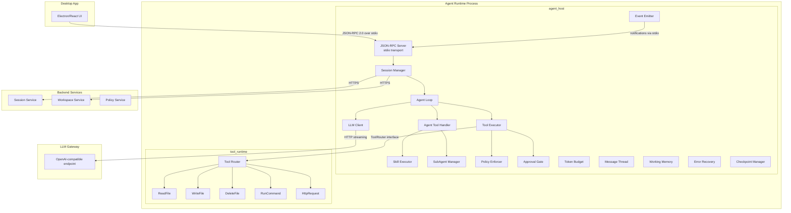
```mermaid
graph TB
    subgraph Desktop App
        UI[Electron/React UI]
    end

    subgraph Agent Runtime Process
        subgraph agent_host
            Server[JSON-RPC Server<br/>stdio transport]
            SM[Session Manager]
            AL[Agent Loop]
            TE[Tool Executor]
            ATH[Agent Tool Handler]
            SE[Skill Executor]
            SAM[SubAgent Manager]
            PE[Policy Enforcer]
            AG[Approval Gate]
            TB[Token Budget]
            LLM[LLM Client]
            MT[Message Thread]
            WM[Working Memory]
            ER[Error Recovery]
            EE[Event Emitter]
            CP[Checkpoint Manager]
        end

        subgraph tool_runtime
            TR[Tool Router]
            RF[ReadFile]
            WF[WriteFile]
            DF[DeleteFile]
            RC[RunCommand]
            HR[HttpRequest]
        end
    end

    subgraph Backend Services
        SS[Session Service]
        WS[Workspace Service]
        PS[Policy Service]
    end

    subgraph LLM Gateway
        GW[OpenAI-compatible endpoint]
    end

    UI -->|JSON-RPC 2.0 over stdio| Server
    Server --> SM
    SM --> AL
    AL --> LLM
    AL --> TE
    AL --> ATH
    ATH --> SE
    ATH --> SAM
    TE --> PE
    TE --> AG
    TE -->|ToolRouter interface| TR
    TR --> RF & WF & DF & RC & HR
    LLM -->|HTTP streaming| GW
    SM -->|HTTPS| SS
    SM -->|HTTPS| WS
    EE -->|notifications via stdio| Server
```

---

## 2. Process Lifecycle

The agent host runs as a child process of the Desktop App, communicating over **stdin/stdout** using newline-delimited JSON-RPC 2.0.

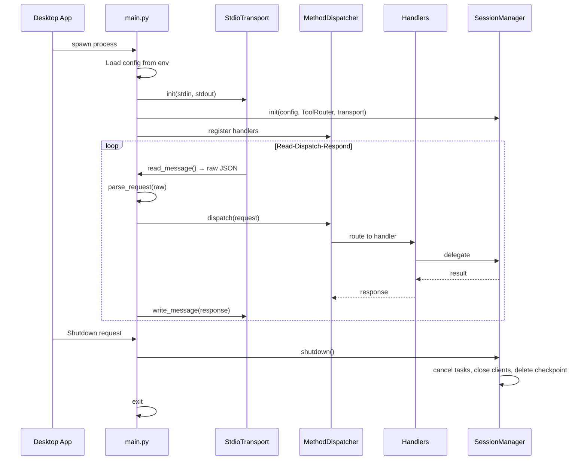
```mermaid
sequenceDiagram
    participant App as Desktop App
    participant Main as main.py
    participant Transport as StdioTransport
    participant Dispatcher as MethodDispatcher
    participant Handlers as Handlers
    participant SM as SessionManager

    App->>Main: spawn process
    Main->>Main: Load config from env
    Main->>Transport: init(stdin, stdout)
    Main->>SM: init(config, ToolRouter, transport)
    Main->>Dispatcher: register handlers

    loop Read-Dispatch-Respond
        Transport->>Main: read_message() → raw JSON
        Main->>Main: parse_request(raw)
        Main->>Dispatcher: dispatch(request)
        Dispatcher->>Handlers: route to handler
        Handlers->>SM: delegate
        SM-->>Handlers: result
        Handlers-->>Dispatcher: response
        Main->>Transport: write_message(response)
    end

    App->>Main: Shutdown request
    Main->>SM: shutdown()
    SM->>SM: cancel tasks, close clients, delete checkpoint
    Main->>Main: exit
```

**Entry point:** `agent_host/main.py:run()`

The JSON-RPC server exposes these methods:

| Method | Purpose |
|--------|---------|
| `CreateSession` | Handshake with Session Service, initialize all components |
| `ResumeSession` | Resume existing session, restore history from Workspace Service |
| `StartTask` | Begin agent work cycle from user prompt |
| `CancelTask` | Cooperatively cancel running task |
| `GetSessionState` | Return current session/task status + token usage |
| `ApproveAction` | Deliver user approval/denial decision |
| `GetPatchPreview` | Return unified diffs for file changes |
| `Shutdown` | Clean session teardown |

---

## 3. Session Management

`SessionManager` is the central lifecycle coordinator. It wires together all components and manages session state.

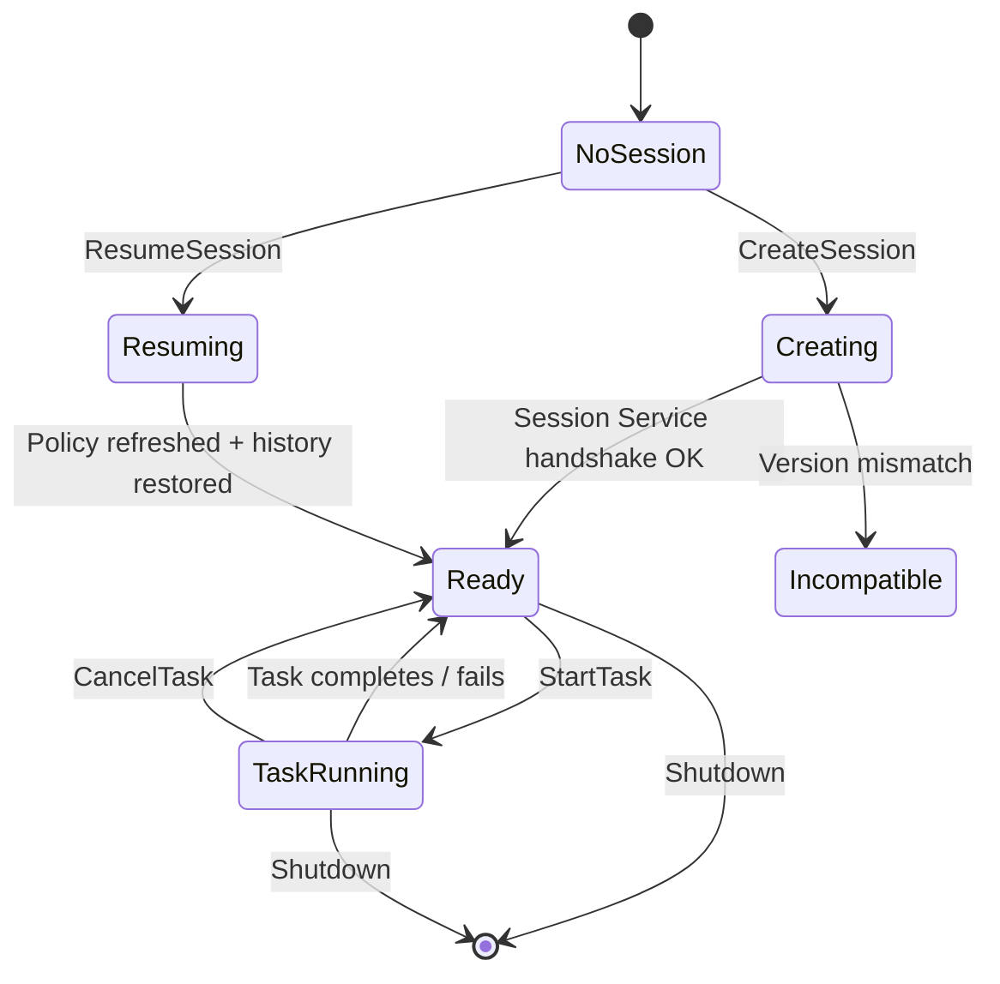
```mermaid
stateDiagram-v2
    [*] --> NoSession
    NoSession --> Creating: CreateSession
    Creating --> Ready: Session Service handshake OK
    Creating --> Incompatible: Version mismatch
    Ready --> TaskRunning: StartTask
    TaskRunning --> Ready: Task completes / fails
    TaskRunning --> Ready: CancelTask
    Ready --> [*]: Shutdown
    TaskRunning --> [*]: Shutdown

    NoSession --> Resuming: ResumeSession
    Resuming --> Ready: Policy refreshed + history restored
```

### CreateSession Flow

1. Build `SessionCreateRequest` with tenant/user IDs, client info, workspace hint
2. Derive supported capabilities from `ToolRouter.get_available_tools()` + `LLM.Call`
3. Call Session Service (`POST /sessions`)
4. Store `SessionContext` (session_id, workspace_id, tenant_id, user_id)
5. Create `EventEmitter` with session context
6. Initialize components from policy bundle:
   - `PolicyEnforcer` — indexes capabilities for O(1) lookup
   - `TokenBudget` — session-level token limit from `llmPolicy.maxSessionTokens`
   - `ApprovalGate` — manages pending approval Futures
   - `FileChangeTracker` — tracks file mutations for patch preview
   - `LLMClient` — OpenAI SDK streaming client pointed at LLM Gateway
   - `MessageThread` — conversation history with system prompt
   - `SkillLoader` — loads skills from built-in, workspace, and policy sources
7. Restore from checkpoint (crash recovery — token budget, thread, working memory, session messages)
8. Emit `session_created` event

### StartTask Flow

1. Parse `taskOptions.maxSteps` (clamped to 1–200, default 50)
2. Add user prompt to `MessageThread`
3. Build `ToolExecutor` with all dependencies
4. Initialize or reuse `WorkingMemory` (task tracker, plan, notes)
5. Create `SubAgentManager` (for `SpawnAgent` tool)
6. Create `SkillExecutor` (for `Skill_*` tools)
7. Build `AgentLoop` with all components (including working memory, sub-agent manager, skill executor, loaded skills)
8. Spawn as background `asyncio.Task` — returns immediately with `{taskId, status: "running"}`
9. On completion: persist checkpoint (including working memory), upload history, emit events

---

## 4. The Agent Loop

**File:** `agent_host/loop/agent_loop.py`

The core of the system. A `while` loop that alternates between LLM calls and tool execution until the task is done, cancelled, or hits limits.

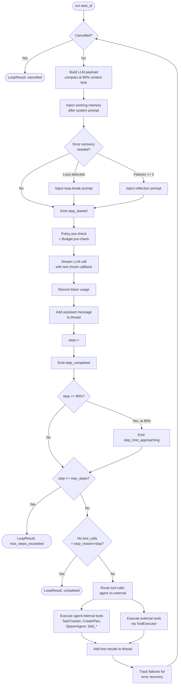
```mermaid
flowchart TD
    Start([run task_id]) --> CheckCancel{Cancelled?}
    CheckCancel -->|Yes| ReturnCancelled([LoopResult: cancelled])
    CheckCancel -->|No| BuildMessages[Build LLM payload<br/>compact at 90% context limit]

    BuildMessages --> InjectWM[Inject working memory<br/>after system prompt]
    InjectWM --> InjectER{Error recovery<br/>needed?}
    InjectER -->|Loop detected| InjectLoop[Inject loop-break prompt]
    InjectER -->|Failures >= 3| InjectReflect[Inject reflection prompt]
    InjectER -->|No| EmitStep[Emit step_started]

    InjectLoop --> EmitStep
    InjectReflect --> EmitStep

    EmitStep --> PolicyCheck[Policy pre-check<br/>+ Budget pre-check]
    PolicyCheck --> StreamLLM[Stream LLM call<br/>with text chunk callback]

    StreamLLM --> RecordTokens[Record token usage]
    RecordTokens --> AddAssistant[Add assistant message<br/>to thread]

    AddAssistant --> IncrStep[step++]
    IncrStep --> EmitCompleted[Emit step_completed]

    EmitCompleted --> CheckLimit{step >= 80%?}
    CheckLimit -->|Yes, at 80%| EmitWarning[Emit step_limit_approaching]
    CheckLimit -->|No| CheckMax

    EmitWarning --> CheckMax{step >= max_steps?}
    CheckMax -->|Yes| ReturnMax([LoopResult: max_steps_exceeded])
    CheckMax -->|No| CheckDone

    CheckDone{No tool_calls<br/>+ stop_reason=stop?}
    CheckDone -->|Yes| ReturnDone([LoopResult: completed])
    CheckDone -->|No| RouteCalls

    RouteCalls[Route tool calls:<br/>agent vs external]
    RouteCalls --> ExecAgent[Execute agent-internal tools<br/>TaskTracker, CreatePlan,<br/>SpawnAgent, Skill_*]
    RouteCalls --> ExecExternal[Execute external tools<br/>via ToolExecutor]

    ExecAgent --> AddResults[Add tool results to thread]
    ExecExternal --> AddResults

    AddResults --> TrackErrors[Track failures for<br/>error recovery]
    TrackErrors --> CheckCancel
```

### Key Design Decisions

- **Step = 1 LLM call + 0..N tool calls.** Each iteration of the while loop is one step.
- **Natural termination:** When the LLM returns no tool calls and `stop_reason == "stop"`, the loop ends.
- **Tool call routing:** Tool calls are classified as agent-internal — `TaskTracker`, `CreatePlan`, `SpawnAgent`, and `Skill_*` (bypass policy/ToolRouter) — or external (full lifecycle).
- **80% warning:** At 80% of max_steps, an event warns the Desktop App.
- **Compaction at 90%:** Context is compacted when it reaches 90% of `max_context_tokens`.

### LoopResult

```python
@dataclass(frozen=True)
class LoopResult:
    reason: str  # "completed" | "cancelled" | "max_steps_exceeded" | "error"
    text: str = ""
    step_count: int = 0
```

---

## 5. Tool System

### Two-Layer Architecture

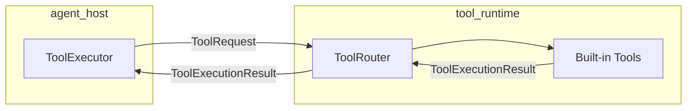
```mermaid
graph LR
    subgraph agent_host
        TE[ToolExecutor]
    end

    subgraph tool_runtime
        TR[ToolRouter]
        BT[Built-in Tools]
    end

    TE -->|ToolRequest| TR
    TR --> BT
    BT -->|ToolExecutionResult| TR
    TR -->|ToolExecutionResult| TE
```

**ToolExecutor** (agent_host) handles the full lifecycle:

1. **Policy check** — Is the capability granted? Are scope constraints satisfied?
2. **Event emission** — `tool_requested`
3. **Approval gate** — If `APPROVAL_REQUIRED`, block until user decides (or 300s timeout)
4. **File change tracking** — Capture file content before mutation
5. **ToolRouter.execute()** — Actual tool execution
6. **Record file changes** — Capture content after mutation for diff
7. **Artifact upload** — Fire-and-forget to Workspace Service
8. **Event emission** — `tool_completed`

**ToolRouter** (tool_runtime) handles dispatch:
- Registry of `BaseTool` implementations
- Routes `ToolRequest` → tool → `ToolExecutionResult`
- **Never raises** — all errors captured as `status="failed"`

### Tool-to-Capability Mapping

| Tool | Capability | Description |
|------|-----------|-------------|
| `ReadFile` | `File.Read` | Read files with encoding detection, offset/limit |
| `WriteFile` | `File.Write` | Atomic writes with diff generation |
| `DeleteFile` | `File.Delete` | Delete files (not directories) |
| `RunCommand` | `Shell.Exec` | Execute shell commands with timeout + process tree kill |
| `HttpRequest` | `Network.Http` | HTTP requests with SSRF prevention |

### Tool Execution Sequence

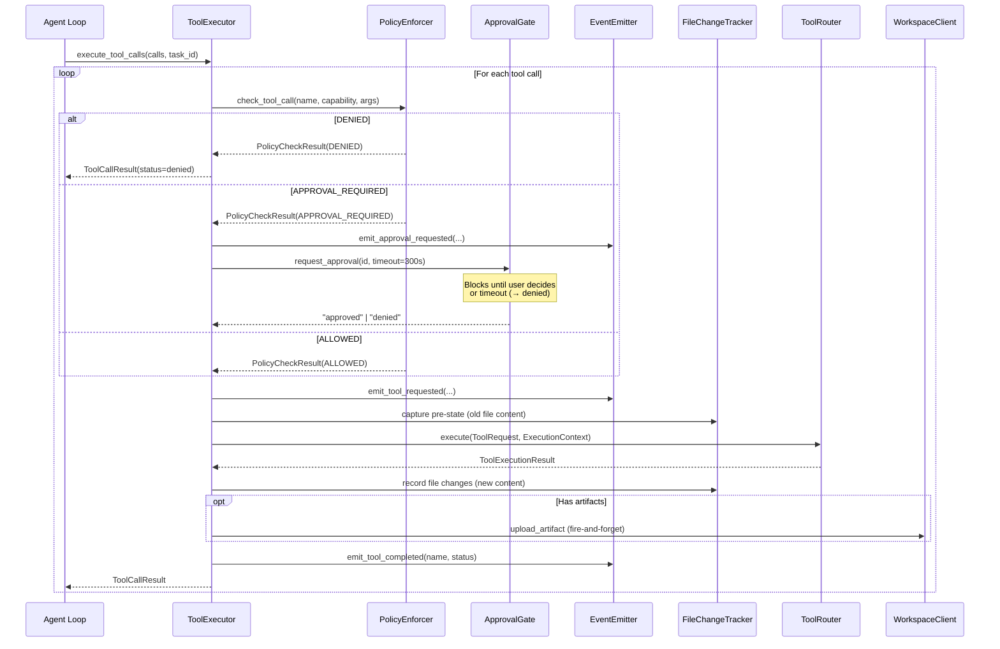
```mermaid
sequenceDiagram
    participant AL as Agent Loop
    participant TE as ToolExecutor
    participant PE as PolicyEnforcer
    participant AG as ApprovalGate
    participant EE as EventEmitter
    participant FCT as FileChangeTracker
    participant TR as ToolRouter
    participant WC as WorkspaceClient

    AL->>TE: execute_tool_calls(calls, task_id)

    loop For each tool call
        TE->>PE: check_tool_call(name, capability, args)
        alt DENIED
            PE-->>TE: PolicyCheckResult(DENIED)
            TE-->>AL: ToolCallResult(status=denied)
        else APPROVAL_REQUIRED
            PE-->>TE: PolicyCheckResult(APPROVAL_REQUIRED)
            TE->>EE: emit_approval_requested(...)
            TE->>AG: request_approval(id, timeout=300s)
            Note over AG: Blocks until user decides<br/>or timeout (→ denied)
            AG-->>TE: "approved" | "denied"
        else ALLOWED
            PE-->>TE: PolicyCheckResult(ALLOWED)
        end

        TE->>EE: emit_tool_requested(...)
        TE->>FCT: capture pre-state (old file content)
        TE->>TR: execute(ToolRequest, ExecutionContext)
        TR-->>TE: ToolExecutionResult

        TE->>FCT: record file changes (new content)

        opt Has artifacts
            TE->>WC: upload_artifact (fire-and-forget)
        end

        TE->>EE: emit_tool_completed(name, status)
        TE-->>AL: ToolCallResult
    end
```

---

## 6. Policy Enforcement

**File:** `agent_host/policy/policy_enforcer.py`

The `PolicyEnforcer` is **stateless and pure** — no I/O, no side effects. It receives a `PolicyBundle` at init and validates tool calls against it.


```mermaid
flowchart TD
    Check[check_tool_call<br/>tool_name, capability, args] --> Expired{Policy<br/>expired?}
    Expired -->|Yes| Deny1([DENIED: Policy expired])
    Expired -->|No| CapGranted{Capability<br/>granted?}

    CapGranted -->|No| Deny2([DENIED: Capability not granted])
    CapGranted -->|Yes| ScopeCheck{Scope<br/>constraints?}

    ScopeCheck --> PathCheck[Path matcher<br/>allowedPaths, blockedPaths]
    ScopeCheck --> CmdCheck[Command matcher<br/>allowedCommands, blockedCommands]
    ScopeCheck --> DomainCheck[Domain matcher<br/>allowedDomains, blockedDomains]

    PathCheck --> ScopeResult{Pass?}
    CmdCheck --> ScopeResult
    DomainCheck --> ScopeResult

    ScopeResult -->|No| Deny3([DENIED: Scope violation])
    ScopeResult -->|Yes| ApprovalCheck{Requires<br/>approval?}

    ApprovalCheck -->|Yes| RiskAssess[Assess risk level]
    RiskAssess --> ApprovalReq([APPROVAL_REQUIRED])
    ApprovalCheck -->|No| Allow([ALLOWED])
```

### Scope Matchers

| Capability | Matcher | Checks |
|-----------|---------|--------|
| `File.Read`, `File.Write`, `File.Delete` | **PathMatcher** | `allowedPaths`, `blockedPaths` (glob patterns) |
| `Shell.Exec` | **CommandMatcher** | `allowedCommands`, `blockedCommands` |
| `Network.Http` | **DomainMatcher** | `allowedDomains`, `blockedDomains` (includes subdomains) |

The `check_llm_call()` method verifies the `LLM.Call` capability is granted and the policy is not expired.

### Risk Assessment

**File:** `agent_host/policy/risk_assessor.py`

When a capability has `requiresApproval: true`, the `assess_risk()` function determines the risk level sent with the approval request:

| Capability | Risk Level |
|-----------|-----------|
| `File.Read` | low |
| `File.Write` | medium |
| `File.Delete` | high |
| `Shell.Exec` | medium |
| `Network.Http` | medium |
| `Workspace.Upload` | low |
| `BackendTool.Invoke` | medium |
| Unknown | high |

---

## 7. Approval Gate

**File:** `agent_host/approval/approval_gate.py`

When a tool call requires user approval, the system uses asyncio Futures to block execution until the user decides.

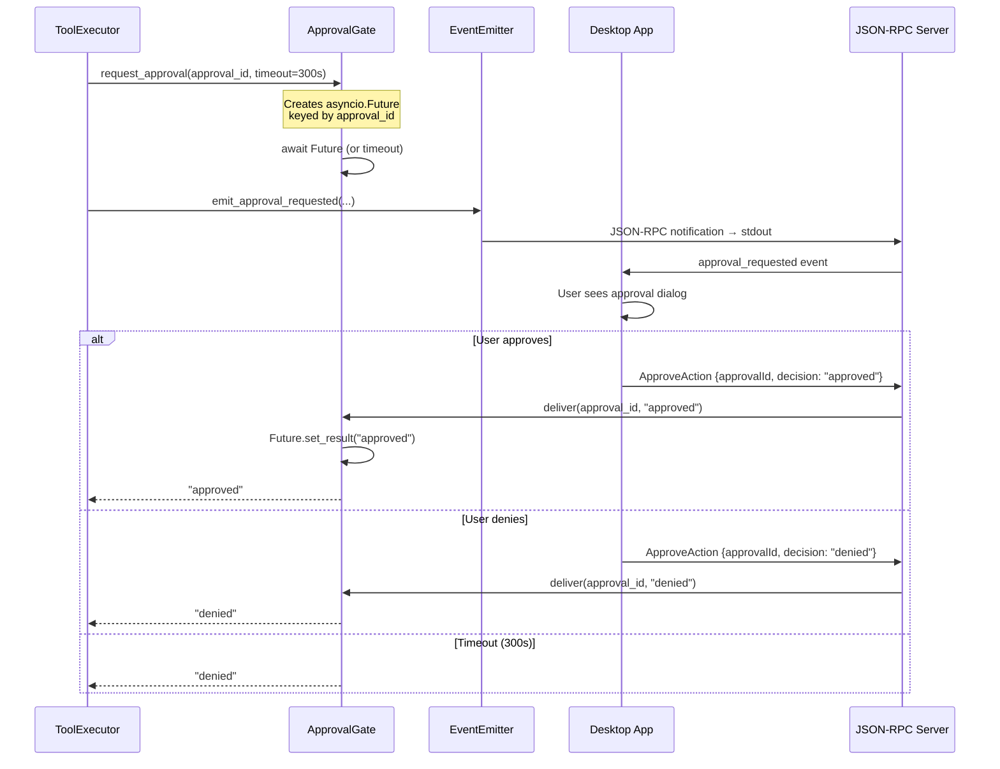
```mermaid
sequenceDiagram
    participant TE as ToolExecutor
    participant AG as ApprovalGate
    participant EE as EventEmitter
    participant App as Desktop App
    participant Server as JSON-RPC Server

    TE->>AG: request_approval(approval_id, timeout=300s)
    Note over AG: Creates asyncio.Future<br/>keyed by approval_id
    AG->>AG: await Future (or timeout)

    TE->>EE: emit_approval_requested(...)
    EE->>Server: JSON-RPC notification → stdout
    Server->>App: approval_requested event

    App->>App: User sees approval dialog

    alt User approves
        App->>Server: ApproveAction {approvalId, decision: "approved"}
        Server->>AG: deliver(approval_id, "approved")
        AG->>AG: Future.set_result("approved")
        AG-->>TE: "approved"
    else User denies
        App->>Server: ApproveAction {approvalId, decision: "denied"}
        Server->>AG: deliver(approval_id, "denied")
        AG-->>TE: "denied"
    else Timeout (300s)
        AG-->>TE: "denied"
    end
```

Key points:
- `request_approval()` creates an `asyncio.Future` and awaits it with a 300s timeout
- `deliver()` resolves the Future when the user responds via the `ApproveAction` JSON-RPC method
- Timeout defaults to "denied" — no indefinite hangs
- Thread-safe for single-threaded asyncio (no locks)

---

## 8. Working Memory

**File:** `agent_host/memory/working_memory.py`

Working memory is **structured agent state** injected into every LLM call after the system prompt. It prevents goal drift during long multi-step tasks.

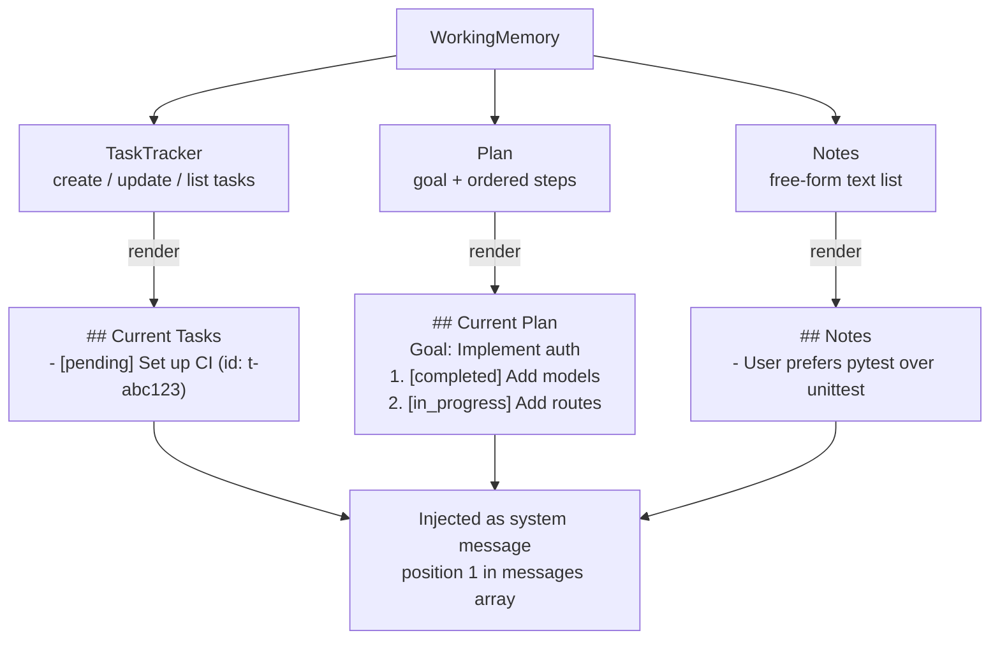
```mermaid
graph TD
    WM[WorkingMemory]
    WM --> TT[TaskTracker<br/>create / update / list tasks]
    WM --> Plan[Plan<br/>goal + ordered steps]
    WM --> Notes[Notes<br/>free-form text list]

    TT -->|render| TT_Text["## Current Tasks<br/>- [pending] Set up CI (id: t-abc123)"]
    Plan -->|render| Plan_Text["## Current Plan<br/>Goal: Implement auth<br/>1. [completed] Add models<br/>2. [in_progress] Add routes"]
    Notes -->|render| Notes_Text["## Notes<br/>- User prefers pytest over unittest"]

    TT_Text --> Inject[Injected as system message<br/>position 1 in messages array]
    Plan_Text --> Inject
    Notes_Text --> Inject
```

### Components

**TaskTracker** — structured task list:
```python
@dataclass
class TrackedTask:
    id: str              # "t-abc12345"
    content: str         # "Implement login endpoint"
    status: Literal["pending", "in_progress", "completed", "failed"]
```

**Plan** — goal with ordered steps:
```python
@dataclass
class Plan:
    goal: str            # "Implement user authentication"
    steps: list[PlanStep]  # Each with description + status

@dataclass
class PlanStep:
    description: str
    status: Literal["pending", "in_progress", "completed", "skipped"]
```

**Notes** — free-form text list for observations.

Working memory is rendered as text and inserted at `messages[1]` (right after the system prompt) on every LLM call.

---

## 9. Agent-Internal Tools

**File:** `agent_host/loop/agent_tools.py`

Agent-internal tools manipulate working memory, spawn sub-agents, and invoke skills. They bypass the `PolicyEnforcer` and `ToolRouter` entirely.

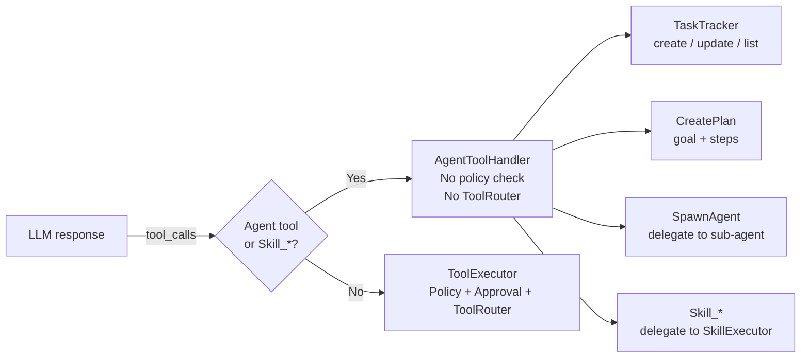
```mermaid
graph LR
    LLM[LLM response] -->|tool_calls| Route{Agent tool<br/>or Skill_*?}
    Route -->|Yes| ATH[AgentToolHandler<br/>No policy check<br/>No ToolRouter]
    Route -->|No| TE[ToolExecutor<br/>Policy + Approval + ToolRouter]

    ATH --> TT[TaskTracker<br/>create / update / list]
    ATH --> CP[CreatePlan<br/>goal + steps]
    ATH --> SA[SpawnAgent<br/>delegate to sub-agent]
    ATH --> SK[Skill_*<br/>delegate to SkillExecutor]
```

The `AgentToolHandler` is initialized with `WorkingMemory`, `SubAgentManager`, `SkillExecutor`, and the loaded `SkillDefinition` list. It builds tool definitions for all agent-internal tools plus one `Skill_{name}` tool per loaded skill.

The `is_agent_tool()` method checks both the static `AGENT_TOOL_NAMES` set (`TaskTracker`, `CreatePlan`, `SpawnAgent`) and the dynamic `_skill_tool_names` set (e.g., `Skill_search_codebase`).

The `execute()` method takes `tool_name`, `arguments`, and `task_id` — the `task_id` is passed through to the `SkillExecutor` for tracking.

### TaskTracker Tool

| Action | Parameters | Effect |
|--------|-----------|--------|
| `create` | `content` | Add a new tracked task, return task ID |
| `update` | `taskId`, `status?`, `content?` | Update task status or description |
| `list` | — | Return all tasks with IDs and statuses |

### CreatePlan Tool

| Parameter | Type | Description |
|-----------|------|-------------|
| `goal` | string | Overall goal of the plan |
| `steps` | string[] | Ordered list of step descriptions |

Creates or replaces the current plan in working memory.

### SpawnAgent Tool

| Parameter | Type | Description |
|-----------|------|-------------|
| `task` | string | Task description for the sub-agent |
| `context` | string? | Relevant context from current work |

Only available when `SubAgentManager` is configured. Delegates to the sub-agent system (see next section).

### Skill Tools (`Skill_*`)

Each loaded skill is exposed as an agent-internal tool named `Skill_{skill.name}` (e.g., `Skill_search_codebase`, `Skill_edit_and_verify`). When invoked:

1. The `Skill_` prefix is stripped to resolve the skill name
2. The matching `SkillDefinition` is looked up
3. `SkillExecutor.execute()` runs the skill as a focused sub-conversation
4. Result is returned to the agent loop

This means skills are first-class tools that the LLM can invoke alongside `TaskTracker`, `CreatePlan`, and `SpawnAgent`.

---

## 10. Sub-Agents

**File:** `agent_host/loop/sub_agent.py`

Sub-agents are focused, isolated agent loops that the parent agent can spawn for parallel or delegated work.

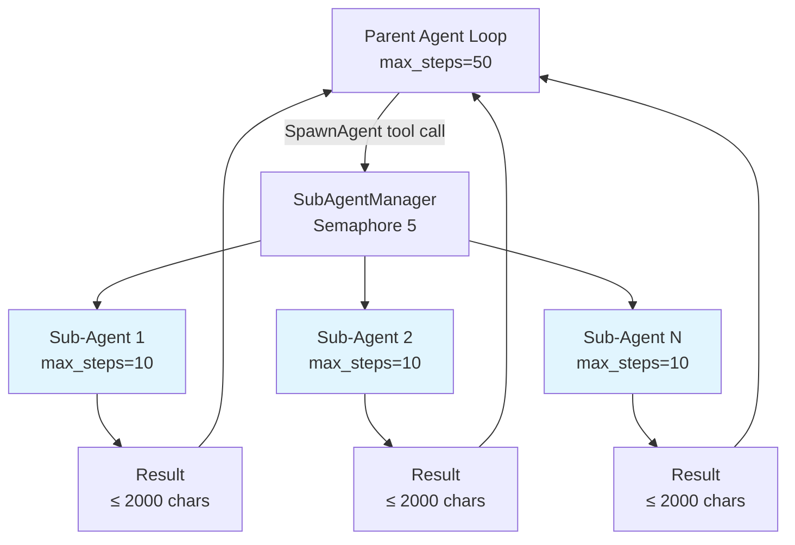
```mermaid
flowchart TB
    Parent[Parent Agent Loop<br/>max_steps=50] -->|SpawnAgent tool call| SAM[SubAgentManager<br/>Semaphore 5]

    SAM --> Sub1[Sub-Agent 1<br/>max_steps=10]
    SAM --> Sub2[Sub-Agent 2<br/>max_steps=10]
    SAM --> SubN[Sub-Agent N<br/>max_steps=10]

    Sub1 --> Result1[Result<br/>≤ 2000 chars]
    Sub2 --> Result2[Result<br/>≤ 2000 chars]
    SubN --> ResultN[Result<br/>≤ 2000 chars]

    Result1 --> Parent
    Result2 --> Parent
    ResultN --> Parent

    style Sub1 fill:#e1f5fe
    style Sub2 fill:#e1f5fe
    style SubN fill:#e1f5fe
```

### Isolation Model

| Property | Parent Agent | Sub-Agent |
|----------|-------------|-----------|
| MessageThread | Shared (cumulative) | Fresh (isolated) |
| TokenBudget | Shared | **Shared** (safe: asyncio is single-threaded) |
| max_steps | 50 (configurable) | **10** (fixed) |
| Working Memory | Yes | **No** |
| Event Emission | Yes | **No** (silent) |
| SpawnAgent tool | Yes | **No** (depth=1, no recursion) |
| Result size | Unlimited | **≤ 2000 chars** |
| Concurrency | 1 | **Semaphore(5)** max concurrent |

### Execution Flow

1. Parent calls `SpawnAgent` tool with task + context
2. `AgentToolHandler` delegates to `SubAgentManager.spawn()`
3. Semaphore limits concurrency to 5 concurrent sub-agents
4. Sub-agent gets:
   - Fresh `MessageThread` with focused system prompt
   - Task as user message
   - `DropOldestCompactor` with recency_window=10
   - Shared `ToolExecutor` and `PolicyEnforcer`
5. Sub-agent runs its own `AgentLoop.run()` with max_steps=10
6. Result text is truncated to 2000 chars and returned to parent

---

## 11. Skills

**Files:** `agent_host/skills/skill_loader.py`, `agent_host/skills/skill_executor.py`

Skills are **formalized multi-step workflows** — reusable sub-conversations with custom system prompts and optional tool restrictions.

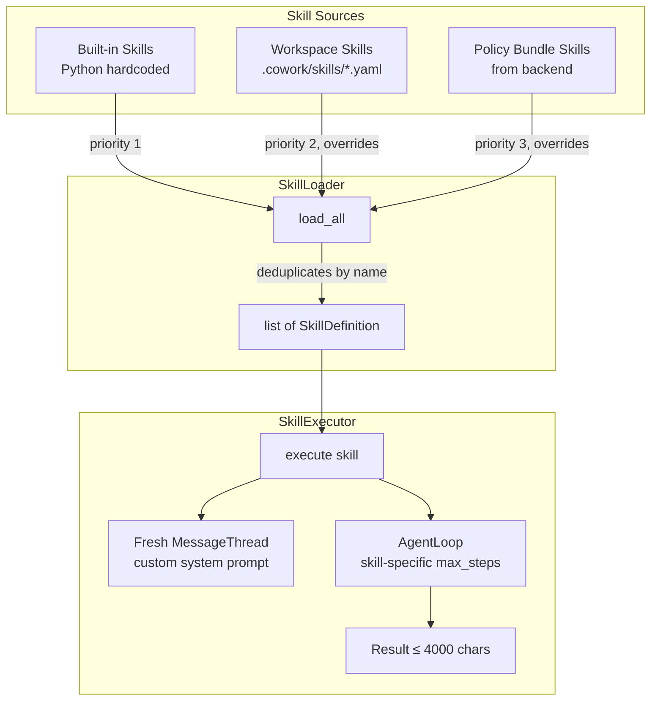
```mermaid
graph TD
    subgraph Skill Sources
        Builtin[Built-in Skills<br/>Python hardcoded]
        Workspace[Workspace Skills<br/>.cowork/skills/*.yaml]
        Policy[Policy Bundle Skills<br/>from backend]
    end

    subgraph SkillLoader
        Load[load_all]
        Builtin -->|priority 1| Load
        Workspace -->|priority 2, overrides| Load
        Policy -->|priority 3, overrides| Load
        Load -->|deduplicates by name| Skills[list of SkillDefinition]
    end

    subgraph SkillExecutor
        Exec[execute skill]
        Skills --> Exec
        Exec --> Thread[Fresh MessageThread<br/>custom system prompt]
        Exec --> Loop[AgentLoop<br/>skill-specific max_steps]
        Loop --> Result[Result ≤ 4000 chars]
    end
```

### SkillDefinition

```python
@dataclass(frozen=True)
class SkillDefinition:
    name: str                        # "search_codebase"
    description: str                 # Human-readable description
    system_prompt_additions: str     # Injected into system prompt
    tool_subset: list[str] | None    # Restrict available tools
    input_schema: dict               # JSON Schema for arguments
    examples: list | None            # Usage examples
    max_steps: int = 15              # Step limit for skill execution
```

### Built-in Skills

| Skill | Tools | max_steps | Purpose |
|-------|-------|-----------|---------|
| `search_codebase` | ReadFile, RunCommand | 15 | Grep patterns + read matching files |
| `edit_and_verify` | ReadFile, WriteFile, RunCommand | 15 | Write → verify → test cycle |
| `debug_error` | ReadFile, RunCommand | 15 | Reproduce → trace → identify fix |

### Skill Loading Priority

1. **Built-in** (always available)
2. **Workspace** (`.cowork/skills/*.yaml` — overrides built-in by name)
3. **Policy bundle** (from `policyBundle.skills` — overrides workspace by name)

### Skill Invocation

Skills are registered as agent-internal tools by `AgentToolHandler` with a `Skill_` prefix. For example, the built-in `search_codebase` skill becomes a tool named `Skill_search_codebase`. The LLM sees these alongside other agent tools (TaskTracker, CreatePlan, SpawnAgent) and can invoke them directly.

When invoked, `AgentToolHandler._handle_skill()` strips the `Skill_` prefix, resolves the `SkillDefinition`, and delegates to `SkillExecutor.execute()`.

### Skill Execution

Skills run as focused sub-conversations, similar to sub-agents but with more structure:

- Custom system prompt: base prompt + `skill.system_prompt_additions`
- User message: formatted from skill arguments
- Dedicated `MessageThread` (isolated)
- `DropOldestCompactor` with recency_window=10
- Shared `TokenBudget`
- No event emission
- Result truncated to 4000 chars (vs 2000 for sub-agents)

---

## 12. LLM Client

**File:** `agent_host/llm/client.py`

The `LLMClient` wraps the OpenAI SDK to stream chat completions from an OpenAI-compatible LLM Gateway.

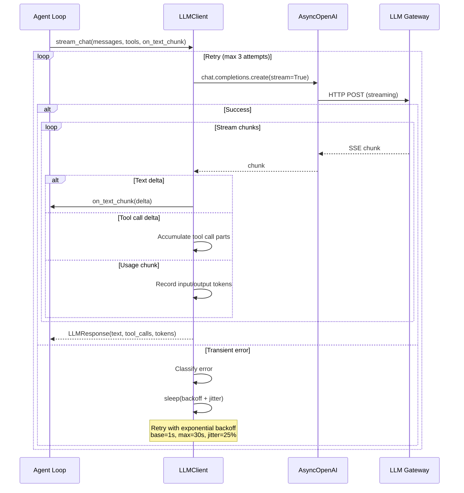
```mermaid
sequenceDiagram
    participant AL as Agent Loop
    participant LLM as LLMClient
    participant SDK as AsyncOpenAI
    participant GW as LLM Gateway

    AL->>LLM: stream_chat(messages, tools, on_text_chunk)

    loop Retry (max 3 attempts)
        LLM->>SDK: chat.completions.create(stream=True)
        SDK->>GW: HTTP POST (streaming)

        alt Success
            loop Stream chunks
                GW-->>SDK: SSE chunk
                SDK-->>LLM: chunk
                alt Text delta
                    LLM->>AL: on_text_chunk(delta)
                else Tool call delta
                    LLM->>LLM: Accumulate tool call parts
                else Usage chunk
                    LLM->>LLM: Record input/output tokens
                end
            end
            LLM-->>AL: LLMResponse(text, tool_calls, tokens)
        else Transient error
            LLM->>LLM: Classify error
            LLM->>LLM: sleep(backoff + jitter)
            Note over LLM: Retry with exponential backoff<br/>base=1s, max=30s, jitter=25%
        end
    end
```

### Configuration

| Parameter | Default | Description |
|-----------|---------|-------------|
| `max_retries` | 3 | Maximum retry attempts for transient errors |
| `retry_base_delay` | 1.0s | Base delay for exponential backoff |
| `retry_max_delay` | 30.0s | Maximum backoff delay |
| `timeout` | 120.0s | HTTP request timeout |

### Error Classification

**File:** `agent_host/llm/error_classifier.py`

- **Transient (retried):** Connection errors (`httpx.ConnectError`, `httpx.ReadError`), timeouts, rate limits (429), server errors (502, 503, 504), and SDK exceptions (`RateLimitError`, `ServiceUnavailableError`, `APIConnectionError`, `APITimeoutError`)
- **Permanent (not retried):** `LLMBudgetExceededError`, `LLMGuardrailBlockedError`, `PolicyExpiredError`, auth errors, invalid requests

### Response Model

```python
@dataclass(frozen=True)
class LLMResponse:
    text: str                        # Concatenated text deltas
    tool_calls: list[ToolCallMessage] # Parsed tool calls
    stop_reason: str = "stop"         # "stop" | "tool_calls" | ...
    input_tokens: int = 0
    output_tokens: int = 0
```

### Token Estimation Fallback

When the API doesn't return usage data (e.g., Anthropic's OpenAI-compatible endpoint), the client falls back to a heuristic: ~1.3 characters per token.

---

## 13. Message Thread & Context Compaction

### MessageThread

**File:** `agent_host/thread/message_thread.py`

Stores the conversation in OpenAI chat completion format:

```mermaid
graph LR
    subgraph MessageThread
        SP[System Prompt]
        U1[User: "Fix the login bug"]
        A1[Assistant: "I'll check the auth module..."<br/>tool_calls: ReadFile]
        T1[Tool: ReadFile result]
        A2[Assistant: "Found the issue..."<br/>tool_calls: WriteFile]
        T2[Tool: WriteFile result]
        A3[Assistant: "Done! The bug was in..."]
    end

    SP --> U1 --> A1 --> T1 --> A2 --> T2 --> A3
```

Messages are stored as dicts matching OpenAI's format:
- `{"role": "system", "content": "..."}`
- `{"role": "user", "content": "..."}`
- `{"role": "assistant", "content": "...", "tool_calls": [...]}`
- `{"role": "tool", "tool_call_id": "...", "name": "...", "content": "..."}`

### Context Compaction

**File:** `agent_host/thread/compactor.py`

When the conversation exceeds 90% of `max_context_tokens`, the `DropOldestCompactor` trims it:

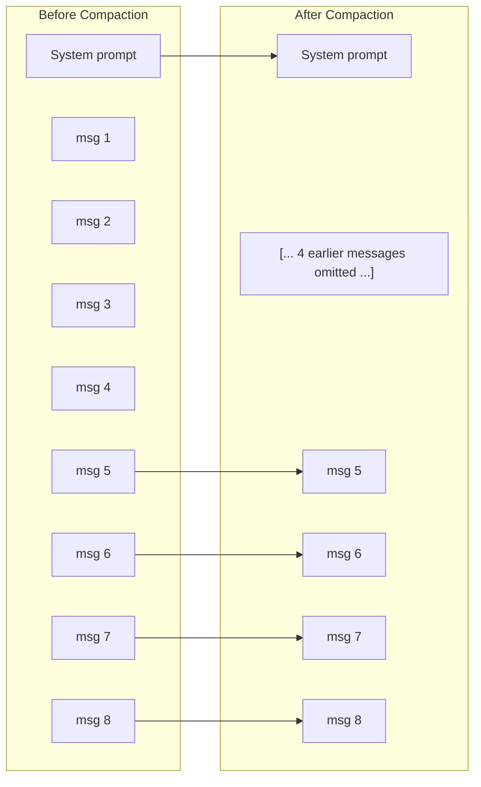
```mermaid
graph LR
    subgraph Before Compaction
        S[System prompt]
        M1[msg 1]
        M2[msg 2]
        M3[msg 3]
        M4[msg 4]
        M5[msg 5]
        M6[msg 6]
        M7[msg 7]
        M8[msg 8]
    end

    subgraph After Compaction
        S2[System prompt]
        Marker["[... 4 earlier messages omitted ...]"]
        M5b[msg 5]
        M6b[msg 6]
        M7b[msg 7]
        M8b[msg 8]
    end

    S --> S2
    M5 --> M5b
    M6 --> M6b
    M7 --> M7b
    M8 --> M8b
```

**Algorithm:**
1. Keep first message (system prompt) always
2. Keep last `recency_window` messages (default 20)
3. Drop oldest messages from the middle until under budget
4. Insert a marker message: `[... N earlier messages omitted ...]`
5. Emit `context_compacted` event with metrics

---

## 14. Error Recovery

**File:** `agent_host/loop/error_recovery.py`

Detects when the agent is stuck and injects prompts to help it recover.

```mermaid
stateDiagram-v2
    [*] --> Normal

    Normal --> ConsecutiveFailures: Tool failure
    ConsecutiveFailures --> ConsecutiveFailures: Another failure
    ConsecutiveFailures --> Normal: Tool success (reset)

    ConsecutiveFailures --> ReflectionInjected: failures >= 3
    Note right of ReflectionInjected: Injects reflection prompt:<br/>"Stop and think about<br/>what went wrong"

    Normal --> LoopDetected: Same tool+args >= 3 times
    Note right of LoopDetected: Injects loop-break prompt:<br/>"You MUST try a<br/>different approach"
```

### Two Mechanisms

**1. Consecutive Failure Reflection** (threshold: 3)

When 3+ tool calls fail in a row, a reflection prompt is injected:

```
## Self-Reflection Required

The last 3 tool calls failed. Stop and think about what went wrong.

1. WriteFile({"path": "/etc/config"}) → Permission denied
2. WriteFile({"path": "/etc/config"}) → Permission denied
3. WriteFile({"path": "/etc/config"}) → Permission denied

Consider:
- Is the approach correct, or should you try a different strategy?
- Are the arguments valid (correct paths, commands, etc.)?
- Is there a prerequisite step you missed?
```

A successful tool call resets the consecutive failure counter.

**2. Loop Detection** (threshold: 3)

When the same tool + arguments combination is called 3+ times (regardless of success), a loop-break prompt is injected:

```
## Loop Detected

You appear to be repeating the same tool calls without making progress.

- Called 4 times: WriteFile(a1b2c3d4)

You MUST try a different approach. Options:
- Use a different tool or different arguments
- Break the task into smaller subtasks
- Report what you've tried and ask the user for guidance
```

Tool call signatures use MD5 hashing of sorted arguments for deduplication.

---

## 15. Event System

**File:** `agent_host/events/event_emitter.py`

Events are emitted through two channels simultaneously:

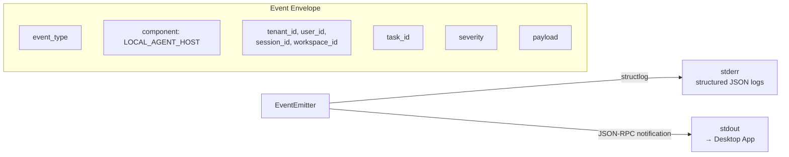
```mermaid
graph LR
    EE[EventEmitter] -->|structlog| Stderr[stderr<br/>structured JSON logs]
    EE -->|JSON-RPC notification| Stdout[stdout<br/>→ Desktop App]

    subgraph Event Envelope
        ET[event_type]
        Comp[component: LOCAL_AGENT_HOST]
        IDs[tenant_id, user_id,<br/>session_id, workspace_id]
        TID[task_id]
        Sev[severity]
        Pay[payload]
    end
```

### Event Types

| Event | Severity | When |
|-------|----------|------|
| `session_created` | info | Session handshake complete |
| `session_completed` | info | Clean shutdown |
| `session_failed` | error | Unrecoverable session error |
| `task_completed` | info | Task finished successfully |
| `task_failed` | error | Task failed or hit step limit |
| `step_started` | info | Beginning of each loop iteration |
| `step_completed` | info | End of each loop iteration |
| `step_limit_approaching` | warning | At 80% of max_steps |
| `text_chunk` | info | Streaming LLM text delta |
| `tool_requested` | info | Before tool execution |
| `tool_completed` | info | After tool execution |
| `approval_requested` | info | Tool needs user approval |
| `llm_retry` | warning | Retrying transient LLM error |
| `context_compacted` | info | Messages dropped for context fit |

All emission is **fire-and-forget** — errors are logged but never propagated.

---

## 16. Token Budget

**File:** `agent_host/budget/token_budget.py`

Session-level cumulative token tracking against a budget from the policy bundle.

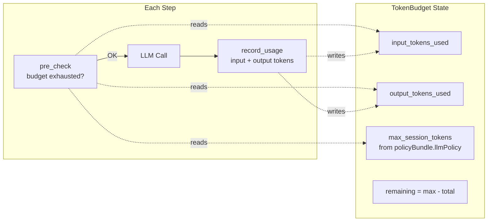
```mermaid
graph LR
    subgraph Each Step
        PreCheck[pre_check<br/>budget exhausted?] -->|OK| LLMCall[LLM Call]
        LLMCall --> Record[record_usage<br/>input + output tokens]
    end

    subgraph TokenBudget State
        Input[input_tokens_used]
        Output[output_tokens_used]
        Max[max_session_tokens<br/>from policyBundle.llmPolicy]
        Remaining[remaining = max - total]
    end

    PreCheck -.->|reads| Max
    PreCheck -.->|reads| Input
    PreCheck -.->|reads| Output
    Record -.->|writes| Input
    Record -.->|writes| Output
```

- `pre_check()` runs before each LLM call — raises `LLMBudgetExceededError` if exhausted
- `record_usage()` adds actual token counts from the LLM response
- `restore_usage()` restores from checkpoint (absolute overwrite, not additive)
- Thread-safe for single-threaded asyncio (no locks needed)
- Shared between parent agent and sub-agents

---

## 17. Crash Recovery (Checkpoints)

**File:** `agent_host/session/checkpoint_manager.py`

Atomic JSON file checkpoints enable crash recovery.

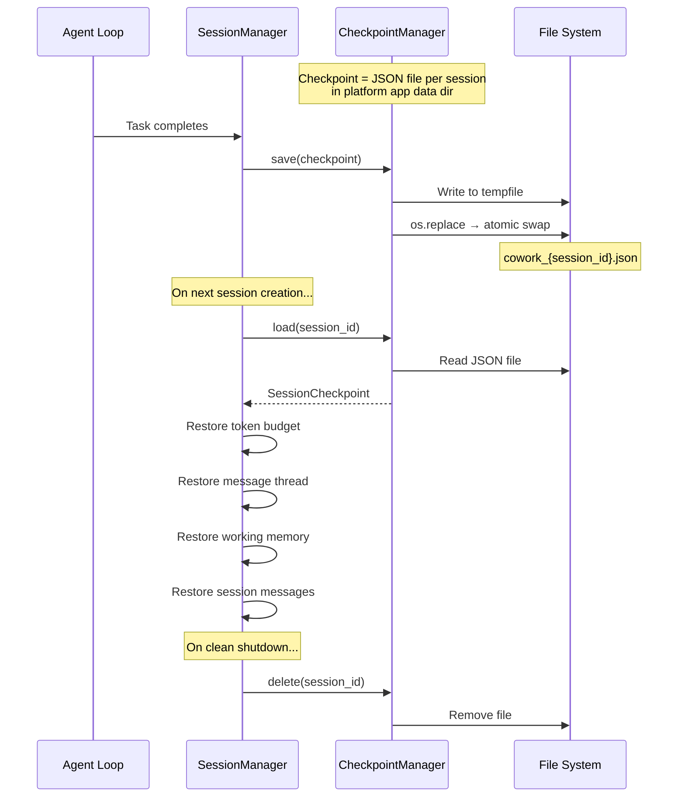
```mermaid
sequenceDiagram
    participant AL as Agent Loop
    participant SM as SessionManager
    participant CM as CheckpointManager
    participant FS as File System

    Note over CM: Checkpoint = JSON file per session<br/>in platform app data dir

    AL->>SM: Task completes
    SM->>CM: save(checkpoint)
    CM->>FS: Write to tempfile
    CM->>FS: os.replace → atomic swap
    Note over FS: cowork_{session_id}.json

    Note over SM: On next session creation...
    SM->>CM: load(session_id)
    CM->>FS: Read JSON file
    CM-->>SM: SessionCheckpoint
    SM->>SM: Restore token budget
    SM->>SM: Restore message thread
    SM->>SM: Restore working memory
    SM->>SM: Restore session messages

    Note over SM: On clean shutdown...
    SM->>CM: delete(session_id)
    CM->>FS: Remove file
```

### Checkpoint Contents

```python
@dataclass
class SessionCheckpoint:
    session_id: str
    workspace_id: str
    tenant_id: str
    user_id: str
    token_input_used: int = 0
    token_output_used: int = 0
    session_messages: list[dict]        # Cumulative ConversationMessages
    thread: list[dict] | None = None    # MessageThread state
    working_memory: dict | None = None  # WorkingMemory state (tasks, plan, notes)
    checkpointed_at: str = ""           # ISO 8601 timestamp
```

### Restore Flow

On session creation or resume, `_restore_from_checkpoint()` restores state in this order:

1. **Token budget** — `restore_usage()` overwrites counters (absolute, not additive)
2. **Message thread** — `MessageThread.from_checkpoint()` rebuilds full conversation history
3. **Working memory** — `WorkingMemory.from_checkpoint()` restores tasks, plan, and notes
4. **Session messages** — Cumulative `ConversationMessage` list for history upload

Each restore step is independent — a failure in one does not block the others.

### Corrupt Checkpoint Handling

If a checkpoint file is corrupt (invalid JSON, missing keys), it is **deleted** and the session starts fresh. This prevents a bad checkpoint from permanently blocking session creation.

**Write strategy:** `tempfile` → `os.replace()` (atomic on all platforms)
**File naming:** `cowork_{session_id}.json` in the platform checkpoint directory
**Lifecycle:** Saved after each task completion (including working memory). Deleted on clean `Shutdown`.

---

## 18. Package Boundary & Dependency Rules

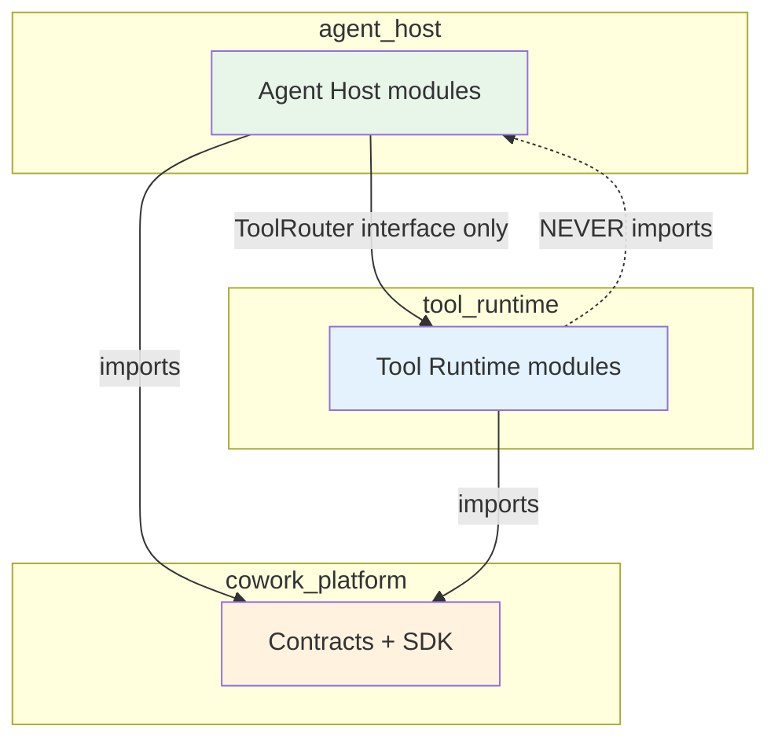
```mermaid
graph TD
    subgraph agent_host
        AH[Agent Host modules]
    end

    subgraph tool_runtime
        TRT[Tool Runtime modules]
    end

    subgraph cowork_platform
        CP[Contracts + SDK]
    end

    AH -->|imports| CP
    TRT -->|imports| CP
    AH -->|ToolRouter interface only| TRT
    TRT -.->|NEVER imports| AH

    style AH fill:#e8f5e9
    style TRT fill:#e3f2fd
    style CP fill:#fff3e0
```

**Strict rules:**
- `agent_host/` and `tool_runtime/` must **NOT** cross-import
- The only interface between them is: `ToolRouter`, `ExecutionContext`, `ToolExecutionResult`
- Both packages depend on `cowork-platform` for shared contracts (ToolRequest, ToolResult, ToolDefinition, PolicyBundle, etc.)

---

## Component Summary

| Component | File | Responsibility |
|-----------|------|---------------|
| **AgentLoop** | `loop/agent_loop.py` | Core LLM ↔ tool loop |
| **SessionManager** | `session/session_manager.py` | Lifecycle coordinator |
| **LLMClient** | `llm/client.py` | OpenAI SDK streaming + retry |
| **ToolRouter** | `tool_runtime/router/tool_router.py` | Tool registry + dispatch |
| **ToolExecutor** | `loop/tool_executor.py` | Policy + approval + artifacts |
| **PolicyEnforcer** | `policy/policy_enforcer.py` | Stateless capability validation |
| **ApprovalGate** | `approval/approval_gate.py` | asyncio Future-based approval |
| **TokenBudget** | `budget/token_budget.py` | Session token tracking |
| **MessageThread** | `thread/message_thread.py` | Conversation history |
| **DropOldestCompactor** | `thread/compactor.py` | Context window management |
| **WorkingMemory** | `memory/working_memory.py` | Task tracker + plan + notes |
| **AgentToolHandler** | `loop/agent_tools.py` | Internal tools + skill tools (no policy) |
| **SubAgentManager** | `loop/sub_agent.py` | Spawn isolated sub-agents |
| **SkillLoader** | `skills/skill_loader.py` | Load skills from 3 sources |
| **SkillExecutor** | `skills/skill_executor.py` | Execute skills as sub-conversations |
| **ErrorRecovery** | `loop/error_recovery.py` | Loop detection + reflection |
| **EventEmitter** | `events/event_emitter.py` | JSON-RPC notifications + logs |
| **CheckpointManager** | `session/checkpoint_manager.py` | Crash recovery persistence |
| **SystemPromptBuilder** | `loop/system_prompt.py` | Dynamic system prompt |
| **FileChangeTracker** | `agent/file_change_tracker.py` | Track file mutations for diffs |
