# Cowork Agent Runtime — Architecture Deep Dive

This document provides a detailed walkthrough of the `cowork-agent-runtime` implementation: the three-layer agent loop architecture (SessionManager → LoopRuntime → LoopStrategy), sub-agents, skills, tool execution, policy enforcement, and all supporting systems.

---

## Table of Contents

1. [High-Level Architecture](#1-high-level-architecture)
2. [Process Lifecycle](#2-process-lifecycle)
3. [Session Management](#3-session-management)
4. [The Agent Loop](#4-the-agent-loop)
5. [Tool System](#5-tool-system)
6. [Policy Enforcement](#6-policy-enforcement)
7. [Approval Gate](#7-approval-gate)
8. [Working Memory](#8-working-memory)
9. [Agent-Internal Tools](#9-agent-internal-tools)
10. [Sub-Agents](#10-sub-agents)
11. [Skills](#11-skills)
12. [LLM Client](#12-llm-client)
13. [Message Thread & Context Compaction](#13-message-thread--context-compaction)
14. [Error Recovery](#14-error-recovery)
15. [Event System](#15-event-system)
16. [Token Budget](#16-token-budget)
17. [Crash Recovery (Checkpoints)](#17-crash-recovery-checkpoints)
18. [Code Execution](#18-code-execution)
19. [Persistent Memory](#19-persistent-memory)
20. [Package Boundary & Dependency Rules](#20-package-boundary--dependency-rules)

---

## 1. High-Level Architecture

The agent runtime is split into two packages with a strict boundary:

```
cowork-agent-runtime/src/
├── agent_host/          # Agent loop, session management, LLM client, policy, events
│   ├── server/          # JSON-RPC 2.0 server (stdio transport)
│   ├── session/         # Session/workspace HTTP clients, checkpoint manager
│   ├── loop/            # LoopRuntime, LoopStrategy, ReactLoop, tool executor, agent tools, error recovery
│   ├── llm/             # LLM Gateway streaming client (OpenAI SDK)
│   ├── thread/          # Message thread, context compaction, token counting
│   ├── memory/          # Working memory + persistent memory (project instructions, auto-memory)
│   ├── skills/          # Skill definitions, loader, executor
│   ├── policy/          # Policy enforcer, matchers, risk assessor
│   ├── budget/          # Token budget tracking
│   ├── approval/        # Approval gate (asyncio Futures)
│   ├── events/          # Event emitter (JSON-RPC notifications + structlog)
│   └── agent/           # File change tracker
│
└── tool_runtime/        # Tool execution (isolated from agent_host)
    ├── router/          # ToolRouter (registry, dispatch)
    ├── tools/           # Built-in tools (file, shell, network, code)
    │   ├── file/        # 11 file manipulation tools
    │   ├── shell/       # RunCommand (Shell.Exec)
    │   ├── network/     # HttpRequest, FetchUrl, WebSearch
    │   └── code/        # ExecuteCode (Code.Execute)
    ├── code/            # Python execution engine (PythonExecutor, preamble)
    ├── platform/        # OS abstraction (macOS/Windows/Linux)
    └── output/          # Output formatting, truncation, artifact extraction
```

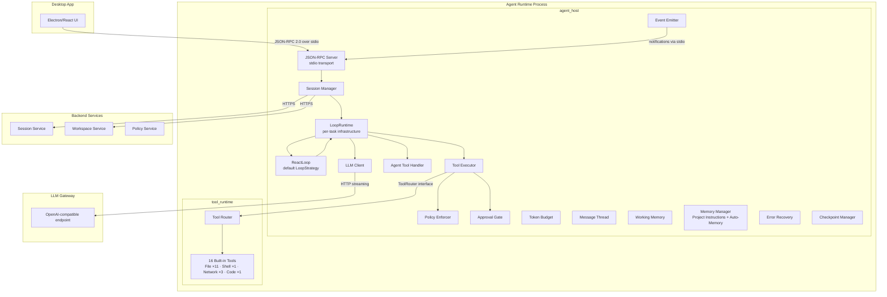

---

## 2. Process Lifecycle

The agent host runs as a child process of the Desktop App, communicating over **stdin/stdout** using newline-delimited JSON-RPC 2.0.

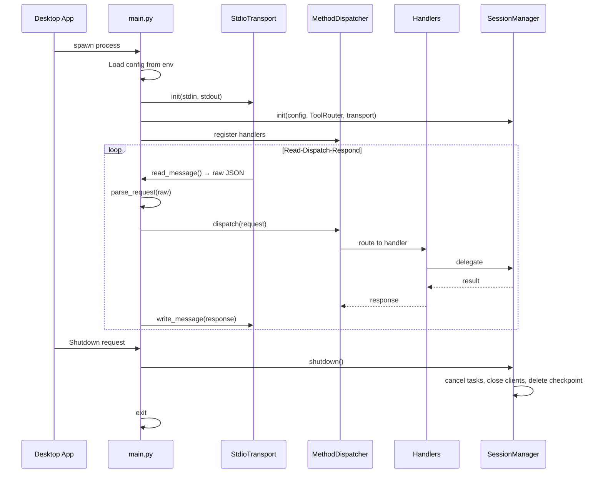

**Entry point:** `agent_host/main.py:run()`

The JSON-RPC server exposes these methods:

| Method | Purpose |
|--------|---------|
| `CreateSession` | Handshake with Session Service, initialize all components |
| `ResumeSession` | Resume existing session, restore history from Workspace Service |
| `StartTask` | Begin agent work cycle from user prompt |
| `CancelTask` | Cooperatively cancel running task |
| `GetSessionState` | Return current session/task status + token usage |
| `ApproveAction` | Deliver user approval/denial decision |
| `GetPatchPreview` | Return unified diffs for file changes |
| `Shutdown` | Clean session teardown |

---

## 3. Session Management

`SessionManager` is the central lifecycle coordinator. It wires together all components and manages session state.

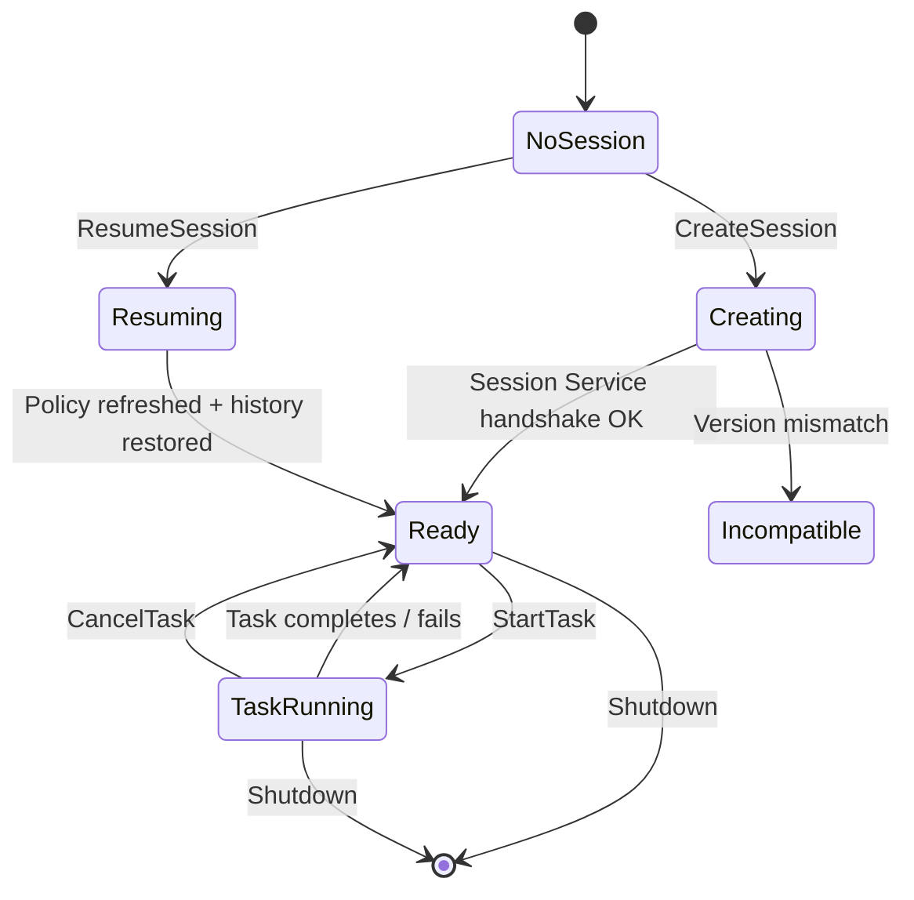

### CreateSession Flow

1. Build `SessionCreateRequest` with tenant/user IDs, client info, workspace hint
2. Derive supported capabilities from `ToolRouter.get_available_tools()` + `LLM.Call`
3. Call Session Service (`POST /sessions`)
4. Store `SessionContext` (session_id, workspace_id, tenant_id, user_id)
5. Create `EventEmitter` with session context
6. Initialize components from policy bundle:
   - `PolicyEnforcer` — indexes capabilities for O(1) lookup
   - `TokenBudget` — session-level token limit from `llmPolicy.maxSessionTokens`
   - `ApprovalGate` — manages pending approval Futures
   - `FileChangeTracker` — tracks file mutations for patch preview
   - `LLMClient` — OpenAI SDK streaming client pointed at LLM Gateway
   - `MessageThread` — conversation history with system prompt
   - `SkillLoader` — loads skills from built-in, workspace, and policy sources
7. Restore from checkpoint (crash recovery — token budget, thread, working memory, session messages)
8. Emit `session_created` event

### StartTask Flow

1. Parse `taskOptions.maxSteps` (clamped to 1–200, default 50)
2. Add user prompt to `MessageThread`
3. Build `ToolExecutor` with all dependencies
4. Initialize or reuse `WorkingMemory` (task tracker, plan, notes)
5. Build `AgentToolHandler` with working memory, loaded skills, and memory manager
6. Build `LoopRuntime` with all infrastructure (LLM client, tool executor, agent tool handler, token budget, event emitter, checkpoint callback, skills, etc.). LoopRuntime wires its `spawn_sub_agent` and `execute_skill` callbacks into AgentToolHandler post-construction.
7. Build `ReactLoop` (the default `LoopStrategy`) with LoopRuntime and context-assembly components (message thread, working memory, error recovery, compactor, memory manager)
8. Spawn as background `asyncio.Task` — returns immediately with `{taskId, status: "running"}`
9. On completion: persist checkpoint (including working memory), upload history, emit events

---

## 4. The Agent Loop

The agent loop has been decomposed into a **three-layer architecture**:

```
SessionManager (session lifecycle)
  → LoopRuntime (per-task infrastructure primitives)
    → LoopStrategy (orchestration + context assembly)
```

### LoopRuntime — Infrastructure Primitives

**File:** `agent_host/loop/loop_runtime.py`

`LoopRuntime` is a **per-task infrastructure facade**. It owns all backend service coupling and exposes primitives that strategies compose:

| Primitive | Description |
|-----------|-------------|
| `call_llm()` | Policy pre-check + budget pre-check + LLM streaming + token recording |
| `execute_external_tools()` | Dispatch tool calls through `ToolExecutor` (policy, approval, ToolRouter) |
| `execute_agent_tool()` | Dispatch agent-internal tool calls through `AgentToolHandler` |
| `spawn_sub_agent()` | Create child `LoopRuntime` + `ReactLoop` with isolated MessageThread, shared TokenBudget, `Semaphore(5)` concurrency |
| `execute_skill()` | Run a skill as a focused sub-conversation with child `LoopRuntime` + `ReactLoop` |
| `emit_event()` | Fire event through `EventEmitter` |
| `on_step_complete()` | Invoke checkpoint callback |

LoopRuntime wires its `spawn_sub_agent` and `execute_skill` methods as callback functions into `AgentToolHandler` post-construction, avoiding circular dependencies between the handler and the runtime.

### LoopStrategy Protocol

**File:** `agent_host/loop/strategy.py`

A single-method protocol that all loop strategies implement:

```python
class LoopStrategy(Protocol):
    async def run(self, task_id: str) -> LoopResult: ...
```

Strategies compose `LoopRuntime` primitives to implement different orchestration patterns. The runtime provides infrastructure; the strategy decides *what to do* and *in what order*.

### ReactLoop — Default Strategy

**File:** `agent_host/loop/react_loop.py`

The default strategy, extracted from the original monolithic `AgentLoop`. Implements a linear ReAct loop that alternates between LLM calls and tool execution.

**ReactLoop owns:**
- Context assembly (memory injection, working memory injection, compaction, error recovery prompts)
- Tool routing (classifying tool calls as agent-internal vs external)
- Step counting, cancellation checks, step-limit warnings

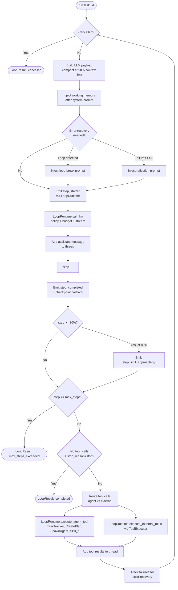

### AgentLoop — Backward-Compatible Alias

**File:** `agent_host/loop/agent_loop.py`

`AgentLoop` is now a thin alias for backward compatibility:

```python
from agent_host.loop.react_loop import ReactLoop as AgentLoop
```

### Key Design Decisions

- **Step = 1 LLM call + 0..N tool calls.** Each iteration of the while loop is one step.
- **Natural termination:** When the LLM returns no tool calls and `stop_reason == "stop"`, the loop ends.
- **Tool call routing:** Tool calls are classified as agent-internal — `TaskTracker`, `CreatePlan`, `SpawnAgent`, and `Skill_*` (bypass policy/ToolRouter) — or external (full lifecycle). This classification happens in `ReactLoop`.
- **80% warning:** At 80% of max_steps, an event warns the Desktop App.
- **Compaction at 90%:** Context is compacted when it reaches 90% of `max_context_tokens`.
- **Strategy is swappable:** Different `LoopStrategy` implementations can be plugged in without changing `LoopRuntime` or `SessionManager`.

### LoopResult

```python
@dataclass(frozen=True)
class LoopResult:
    reason: str  # "completed" | "cancelled" | "max_steps_exceeded" | "error"
    text: str = ""
    step_count: int = 0
```

---

## 5. Tool System

### Two-Layer Architecture

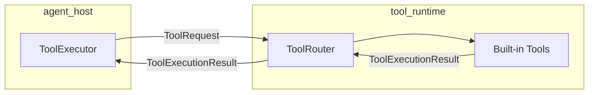

**ToolExecutor** (agent_host) handles the full lifecycle:

1. **Event emission** — `tool_requested` (always emitted first so the Desktop App creates a ToolCallCard — even for denied tools, the card shows a "Denied" badge)
2. **Policy check** — Is the capability granted? Are scope constraints satisfied? If DENIED → emit `tool_completed(denied)` → return
3. **Approval gate** — If `APPROVAL_REQUIRED`, emit `approval_requested`, block until user decides (or 300s timeout)
4. **File change tracking** — Capture file content before mutation
5. **ToolRouter.execute()** — Actual tool execution
6. **Record file changes** — Capture content after mutation for diff
7. **Artifact upload** — Fire-and-forget to Workspace Service
8. **Event emission** — `tool_completed`

**ToolRouter** (tool_runtime) handles dispatch:
- Registry of `BaseTool` implementations
- Routes `ToolRequest` → tool → `ToolExecutionResult`
- **Never raises** — all errors captured as `status="failed"`

**ExecutionContext** carries policy-derived constraints from `agent_host` to `tool_runtime`:

```python
@dataclass(frozen=True)
class ExecutionContext:
    allowed_paths: list[str] | None = None         # File.Read/Write/Delete
    blocked_paths: list[str] | None = None         # File.Read/Write/Delete
    allowed_commands: list[str] | None = None      # Shell.Exec
    blocked_commands: list[str] | None = None      # Shell.Exec
    allowed_domains: list[str] | None = None       # Network.Http
    max_file_size_bytes: int | None = None         # File.Read (default 10MB)
    max_output_bytes: int | None = None            # All tools (default 100KB)
    command_timeout_seconds: int | None = None     # Shell.Exec (default 300s)
    working_directory: str | None = None           # CWD for Shell.Exec / Code.Execute
    allow_code_network: bool = False               # Code.Execute — network access
    max_execution_time_seconds: int | None = None  # Code.Execute — timeout (default 120s)
```

### Tool-to-Capability Mapping

| Tool | Capability | Description |
|------|-----------|-------------|
| `ReadFile` | `File.Read` | Read files with encoding detection, offset/limit |
| `WriteFile` | `File.Write` | Atomic writes with diff generation |
| `DeleteFile` | `File.Delete` | Delete files (not directories) |
| `EditFile` | `File.Write` | Find-and-replace string editing |
| `MultiEdit` | `File.Write` | Batch find-and-replace edits in a single call |
| `CreateDirectory` | `File.Write` | Create directories (including parents) |
| `MoveFile` | `File.Write` | Move or rename files and directories |
| `ListDirectory` | `File.Read` | List directory contents with metadata |
| `FindFiles` | `File.Read` | Glob-pattern file search |
| `GrepFiles` | `File.Read` | Regex content search across files |
| `ViewImage` | `File.Read` | Read image files as base64 for multimodal LLM |
| `RunCommand` | `Shell.Exec` | Execute shell commands with timeout + process tree kill |
| `ExecuteCode` | `Code.Execute` | Execute Python scripts with rich output (images, structured data) |
| `HttpRequest` | `Network.Http` | HTTP requests with SSRF prevention |
| `FetchUrl` | `Network.Http` | Fetch URL and convert HTML to markdown |
| `WebSearch` | `Search.Web` | Web search via Tavily API |

### Tool Execution Sequence

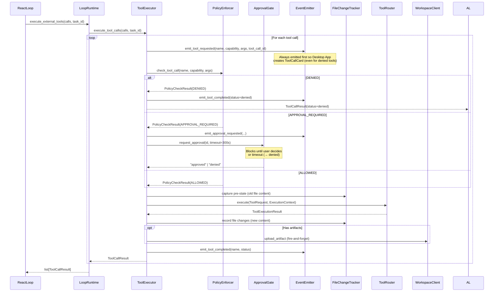

---

## 6. Policy Enforcement

**File:** `agent_host/policy/policy_enforcer.py`

The `PolicyEnforcer` is **stateless and pure** — no I/O, no side effects. It receives a `PolicyBundle` at init and validates tool calls against it.

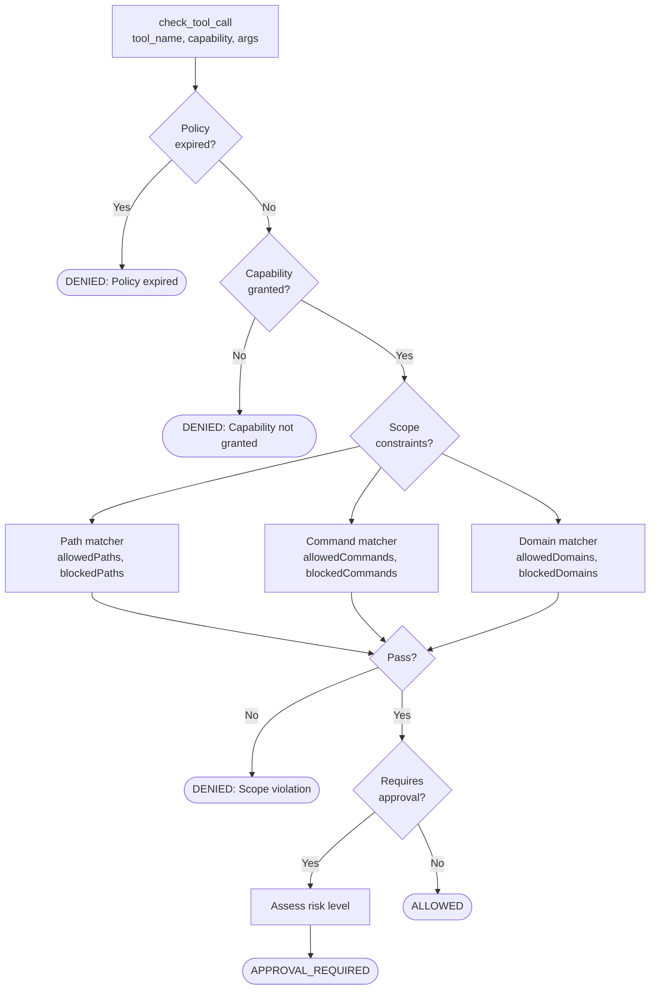

### Scope Matchers

| Capability | Matcher | Checks |
|-----------|---------|--------|
| `File.Read`, `File.Write`, `File.Delete` | **PathMatcher** | `allowedPaths`, `blockedPaths` (prefix matching via `str.startswith()`) |
| `Shell.Exec` | **CommandMatcher** | `allowedCommands`, `blockedCommands` |
| `Network.Http` | **DomainMatcher** | `allowedDomains`, `blockedDomains` (includes subdomains) |
| `Search.Web` | — | No scope constraints; allowed if capability is granted |
| `Code.Execute` | — | Language allowlist check (`allowedLanguages`); allowed if capability is granted |

The `check_llm_call()` method verifies the `LLM.Call` capability is granted and the policy is not expired.

### Risk Assessment

**File:** `agent_host/policy/risk_assessor.py`

When a capability has `requiresApproval: true`, the `assess_risk()` function determines the risk level sent with the approval request:

| Capability | Risk Level |
|-----------|-----------|
| `File.Read` | low |
| `File.Write` | medium |
| `File.Delete` | high |
| `Shell.Exec` | medium |
| `Network.Http` | medium |
| `Code.Execute` | medium |
| `Search.Web` | high (no explicit entry — falls through to Unknown) |
| `Workspace.Upload` | low |
| `BackendTool.Invoke` | medium |
| Unknown | high |

---

## 7. Approval Gate

**File:** `agent_host/approval/approval_gate.py`

When a tool call requires user approval, the system uses asyncio Futures to block execution until the user decides.

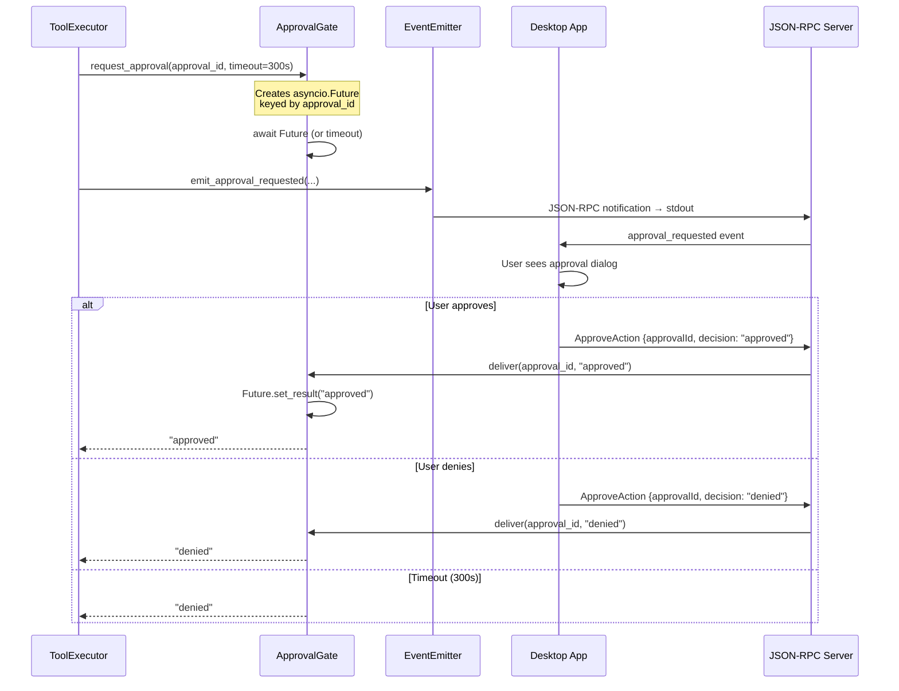

Key points:
- `request_approval()` creates an `asyncio.Future` and awaits it with a 300s timeout
- `deliver()` resolves the Future when the user responds via the `ApproveAction` JSON-RPC method
- Timeout defaults to "denied" — no indefinite hangs
- Thread-safe for single-threaded asyncio (no locks)

---

## 8. Working Memory

**File:** `agent_host/memory/working_memory.py`

Working memory is **structured agent state** injected into every LLM call after the system prompt. It prevents goal drift during long multi-step tasks.

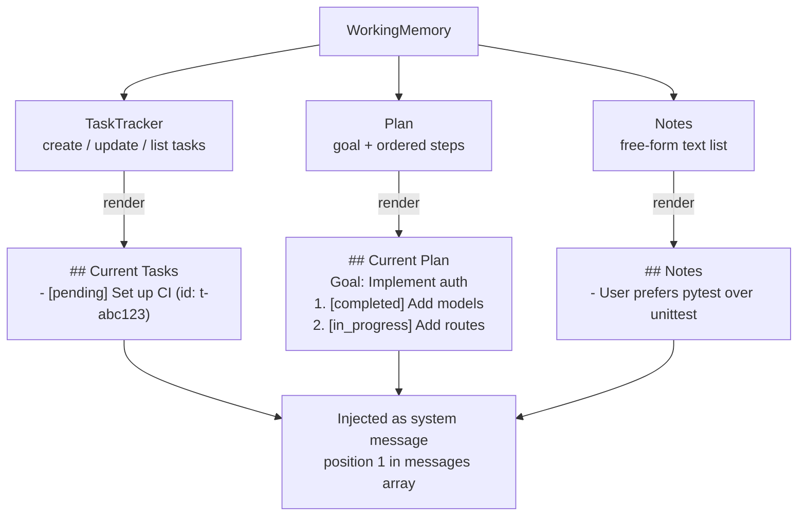

### Components

**TaskTracker** — structured task list:
```python
@dataclass
class TrackedTask:
    id: str              # "t-abc12345"
    content: str         # "Implement login endpoint"
    status: Literal["pending", "in_progress", "completed", "failed"]
```

**Plan** — goal with ordered steps:
```python
@dataclass
class Plan:
    goal: str            # "Implement user authentication"
    steps: list[PlanStep]  # Each with description + status

@dataclass
class PlanStep:
    description: str
    status: Literal["pending", "in_progress", "completed", "skipped"]
```

**Notes** — free-form text list for observations.

Working memory is rendered as text and inserted at `messages[1]` (right after the system prompt) on every LLM call.

---

## 9. Agent-Internal Tools

**File:** `agent_host/loop/agent_tools.py`

Agent-internal tools manipulate working memory, spawn sub-agents, and invoke skills. They bypass the `PolicyEnforcer` and `ToolRouter` entirely.

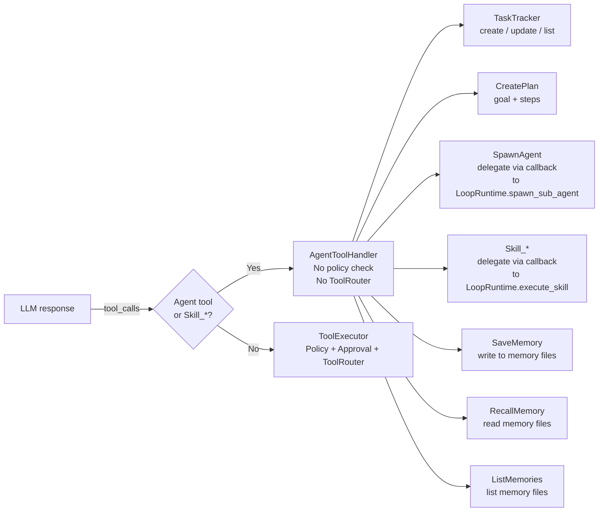

The `AgentToolHandler` is initialized with `WorkingMemory`, the loaded `SkillDefinition` list, and optionally a `MemoryManager`. It builds tool definitions for all agent-internal tools plus one `Skill_{name}` tool per loaded skill. Memory tools (`SaveMemory`, `RecallMemory`, `ListMemories`) are only included when a `MemoryManager` is provided.

**Callback-based wiring:** `AgentToolHandler` does not directly depend on `LoopRuntime`. Instead, it uses callback functions (`spawn_sub_agent` and `execute_skill`) that are wired by `LoopRuntime` post-construction. This avoids circular dependencies — `LoopRuntime` owns `AgentToolHandler`, and `AgentToolHandler` calls back into `LoopRuntime` for sub-agent/skill execution via these callbacks.

The `is_agent_tool()` method checks both the static `AGENT_TOOL_NAMES` set (`TaskTracker`, `CreatePlan`, `SpawnAgent`, `SaveMemory`, `RecallMemory`, `ListMemories`) and the dynamic `_skill_tool_names` set (e.g., `Skill_search_codebase`).

The `execute()` method takes `tool_name`, `arguments`, and `task_id` — the `task_id` is passed through to the skill/sub-agent callbacks for tracking.

### TaskTracker Tool

| Action | Parameters | Effect |
|--------|-----------|--------|
| `create` | `content` | Add a new tracked task, return task ID |
| `update` | `taskId`, `status?`, `content?` | Update task status or description |
| `list` | — | Return all tasks with IDs and statuses |

### CreatePlan Tool

| Parameter | Type | Description |
|-----------|------|-------------|
| `goal` | string | Overall goal of the plan |
| `steps` | string[] | Ordered list of step descriptions |

Creates or replaces the current plan in working memory.

### SpawnAgent Tool

| Parameter | Type | Description |
|-----------|------|-------------|
| `task` | string | Task description for the sub-agent |
| `context` | string? | Relevant context from current work |

Delegates to `LoopRuntime.spawn_sub_agent()` via the callback wired into `AgentToolHandler` (see next section).

### SaveMemory Tool

| Parameter | Type | Description |
|-----------|------|-------------|
| `file` | string? | Memory filename (default: `MEMORY.md`), must match `[a-zA-Z0-9_-]+.md` |
| `content` | string | Full content to write to the file |

Writes to persistent memory files. Only available when `MemoryManager` is configured (see Section 19).

### RecallMemory Tool

| Parameter | Type | Description |
|-----------|------|-------------|
| `file` | string | Memory filename to read (e.g., `debugging.md`) |

Reads a specific persistent memory file. Use `ListMemories` first to see available files.

### ListMemories Tool

No parameters. Returns a list of all `.md` files in the memory directory with their sizes.

### Skill Tools (`Skill_*`)

Each loaded skill is exposed as an agent-internal tool named `Skill_{skill.name}` (e.g., `Skill_search_codebase`, `Skill_edit_and_verify`). When invoked:

1. The `Skill_` prefix is stripped to resolve the skill name
2. The matching `SkillDefinition` is looked up
3. `LoopRuntime.execute_skill()` runs the skill as a focused sub-conversation
4. Result is returned to the agent loop

This means skills are first-class tools that the LLM can invoke alongside `TaskTracker`, `CreatePlan`, and `SpawnAgent`.

---

## 10. Sub-Agents

**File:** `agent_host/loop/sub_agent.py` (constants only), `agent_host/loop/loop_runtime.py` (`spawn_sub_agent()`)

Sub-agents are focused, isolated agent loops that the parent agent can spawn for parallel or delegated work. The spawning logic lives in `LoopRuntime.spawn_sub_agent()`; the file `loop/sub_agent.py` retains only constants (e.g., `SUB_AGENT_MAX_STEPS`, `SUB_AGENT_MAX_RESULT_LENGTH`, `SUB_AGENT_SEMAPHORE_LIMIT`).

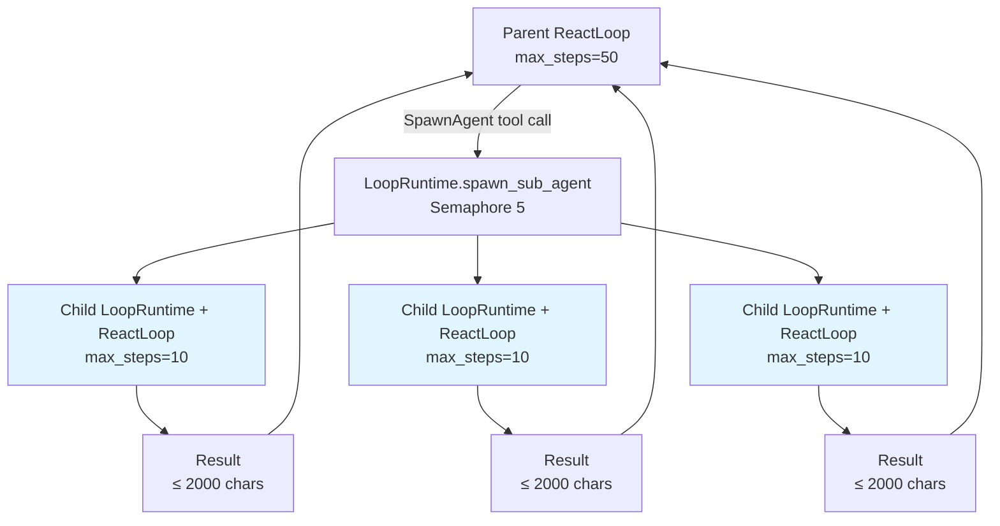

### Isolation Model

| Property | Parent Agent | Sub-Agent |
|----------|-------------|-----------|
| LoopRuntime | Parent instance | **Child instance** (created by parent) |
| LoopStrategy | ReactLoop | **ReactLoop** (same strategy) |
| MessageThread | Shared (cumulative) | Fresh (isolated) |
| TokenBudget | Shared | **Shared** (safe: asyncio is single-threaded) |
| max_steps | 50 (configurable) | **10** (fixed) |
| Working Memory | Yes | **No** |
| Event Emission | Yes | **No** (silent) |
| SpawnAgent tool | Yes | **No** (depth=1, no recursion) |
| Result size | Unlimited | **≤ 2000 chars** |
| Concurrency | 1 | **Semaphore(5)** max concurrent |

### Execution Flow

1. Parent calls `SpawnAgent` tool with task + context
2. `AgentToolHandler` invokes its `spawn_sub_agent` callback (wired to `LoopRuntime.spawn_sub_agent()`)
3. `LoopRuntime.spawn_sub_agent()` acquires the semaphore (limit 5 concurrent)
4. A child `LoopRuntime` is created with:
   - Fresh `MessageThread` with focused system prompt
   - Task as user message
   - `DropOldestCompactor` with recency_window=10
   - Shared `ToolExecutor` and `PolicyEnforcer`
   - Shared `TokenBudget`
   - No event emission, no checkpoint callback
5. A `ReactLoop` is created with the child `LoopRuntime` and runs with max_steps=10
6. Result text is truncated to 2000 chars and returned to parent

---

## 11. Skills

**Files:** `agent_host/skills/models.py`, `agent_host/skills/skill_loader.py`, `agent_host/skills/skill_executor.py` (constants only), `agent_host/loop/loop_runtime.py` (`execute_skill()`)

Skills are **formalized multi-step workflows** — reusable sub-conversations with custom system prompts and optional tool restrictions. Skills use **directory-based Markdown format** with progressive disclosure.

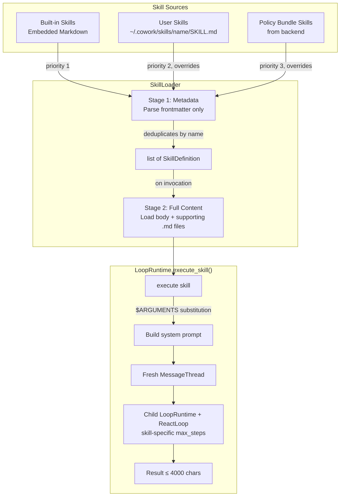

### Skill Directory Structure

```
~/.cowork/skills/
  deploy-staging/
    SKILL.md              # Required: main instructions with YAML frontmatter
    reference.md          # Optional: auto-appended on invocation
    examples.md           # Optional: auto-appended on invocation
  search-codebase/
    SKILL.md              # Simple skill — no supporting files needed
```

### SKILL.md Format

```markdown
---
name: deploy-staging
description: Deploy the application to staging environment.
tool_subset:
  - RunCommand
  - ReadFile
max_steps: 20
disable_model_invocation: false
user_invocable: true
---

You are deploying the application to the staging environment.

## Steps

1. Read the deployment configuration
2. Run the deployment command targeting `$ARGUMENTS[0]`
3. Verify the deployment succeeded
```

### SkillDefinition

```python
@dataclass(frozen=True)
class SkillDefinition:
    name: str                              # "search_codebase"
    description: str                       # Human-readable description
    prompt_content: str = ""               # SKILL.md body + supporting files (lazy-loaded)
    source_dir: str | None = None          # Skill directory path (None for built-in)
    tool_subset: list[str] | None = None   # Restrict available tools
    input_schema: dict = {}                # JSON Schema for arguments
    max_steps: int = 15                    # Step limit for skill execution
    disable_model_invocation: bool = False # True = LLM cannot auto-trigger
    user_invocable: bool = True            # False = hidden from user menus
```

### Built-in Skills

| Skill | Tools | max_steps | Purpose |
|-------|-------|-----------|---------|
| `search_codebase` | ReadFile, RunCommand | 15 | Grep patterns + read matching files |
| `edit_and_verify` | ReadFile, WriteFile, RunCommand | 15 | Write → verify → test cycle |
| `debug_error` | ReadFile, RunCommand | 15 | Reproduce → trace → identify fix |

Built-in skills are defined as embedded Markdown strings in `skill_loader.py` and parsed with the same frontmatter parser as file-based skills. Their `prompt_content` is pre-populated at load time (no lazy loading).

### Progressive Disclosure

**Stage 1 — Metadata (session start):** Parse frontmatter only from each `SKILL.md`. Extract `name`, `description`, flags, `tool_subset`, `max_steps`, `input_schema`. ~100 tokens per skill. Skill registered as tool with LLM. Supporting files are NOT read.

**Stage 2 — Full Content (on invocation):** `SkillLoader.load_skill_content(skill)` reads full `SKILL.md` body + auto-appends all supporting `.md` files from the skill directory (sorted alphabetically, with `## {Filename}` section headers). Returns new frozen instance with `prompt_content` populated.

### Argument Substitution

- `$ARGUMENTS` → all argument values joined with space
- `$ARGUMENTS[N]` → positional argument by 0-based index
- Out-of-range index → empty string
- No arguments → placeholders replaced with empty strings

### Skill Loading Priority

1. **Built-in** (embedded markdown, always available)
2. **User directories** (`~/.cowork/skills/<name>/SKILL.md` — overrides built-in by name)
3. **Policy bundle** (from `policyBundle.skills` — overrides user by name)

### Skill Invocation

Skills are registered as agent-internal tools by `AgentToolHandler` with a `Skill_` prefix. For example, the built-in `search_codebase` skill becomes a tool named `Skill_search_codebase`. The LLM sees these alongside other agent tools (TaskTracker, CreatePlan, SpawnAgent) and can invoke them directly.

Skills with `disable_model_invocation=True` are excluded from `get_tool_definitions()` — the LLM cannot see or auto-trigger them. They can still be invoked explicitly (e.g., by user command).

When invoked, `AgentToolHandler._handle_skill()` strips the `Skill_` prefix, resolves the `SkillDefinition`, and delegates to the `execute_skill` callback (wired to `LoopRuntime.execute_skill()`).

### Skill Execution

Skills run as focused sub-conversations via `LoopRuntime.execute_skill()`, similar to sub-agents but with more structure. The execution logic formerly in `SkillExecutor` has moved into `LoopRuntime`; the file `skills/skill_executor.py` now only holds constants (e.g., `SKILL_MAX_RESULT_LENGTH`).

- Stage 2 loading: `SkillLoader.load_skill_content()` lazily loads full content
- `$ARGUMENTS` substitution applied to `prompt_content`
- Custom system prompt: base prompt + substituted `prompt_content`
- User message: formatted from skill arguments
- Child `LoopRuntime` + `ReactLoop` (isolated)
- Dedicated `MessageThread` (isolated)
- `DropOldestCompactor` with recency_window=10
- Shared `TokenBudget`
- No event emission, no checkpoint callback
- Result truncated to 4000 chars (vs 2000 for sub-agents)

---

## 12. LLM Client

**File:** `agent_host/llm/client.py`

The `LLMClient` wraps the OpenAI SDK to stream chat completions from an OpenAI-compatible LLM Gateway.


### Configuration

| Parameter | Default | Description |
|-----------|---------|-------------|
| `max_retries` | 3 | Maximum retry attempts for transient errors |
| `retry_base_delay` | 1.0s | Base delay for exponential backoff |
| `retry_max_delay` | 30.0s | Maximum backoff delay |
| `timeout` | 120.0s | HTTP request timeout |

### Error Classification

**File:** `agent_host/llm/error_classifier.py`

- **Transient (retried):** Connection errors (`httpx.ConnectError`, `httpx.ReadError`), timeouts, rate limits (429), server errors (502, 503, 504), and SDK exceptions (`RateLimitError`, `ServiceUnavailableError`, `APIConnectionError`, `APITimeoutError`)
- **Permanent (not retried):** `LLMBudgetExceededError`, `LLMGuardrailBlockedError`, `PolicyExpiredError`, auth errors, invalid requests

### Response Model

```python
@dataclass(frozen=True)
class LLMResponse:
    text: str                        # Concatenated text deltas
    tool_calls: list[ToolCallMessage] # Parsed tool calls
    stop_reason: str = "stop"         # "stop" | "tool_calls" | ...
    input_tokens: int = 0
    output_tokens: int = 0
```

### Token Estimation Fallback

When the API doesn't return usage data (e.g., Anthropic's OpenAI-compatible endpoint), the client falls back to the character-count heuristic from `token_counter.py`: ~4 characters per token (`len(text) // 4`).

---

## 13. Message Thread & Context Compaction

### MessageThread

**File:** `agent_host/thread/message_thread.py`

Stores the conversation in OpenAI chat completion format:

```mermaid
graph LR
    subgraph MessageThread
        SP[System Prompt]
        U1[User: "Fix the login bug"]
        A1[Assistant: "I'll check the auth module..."<br/>tool_calls: ReadFile]
        T1[Tool: ReadFile result]
        A2[Assistant: "Found the issue..."<br/>tool_calls: WriteFile]
        T2[Tool: WriteFile result]
        A3[Assistant: "Done! The bug was in..."]
    end

    SP --> U1 --> A1 --> T1 --> A2 --> T2 --> A3
```

Messages are stored as dicts matching OpenAI's format:
- `{"role": "system", "content": "..."}`
- `{"role": "user", "content": "..."}`
- `{"role": "assistant", "content": "...", "tool_calls": [...]}`
- `{"role": "tool", "tool_call_id": "...", "name": "...", "content": "..."}`

### Context Compaction

**File:** `agent_host/thread/compactor.py`

When the conversation exceeds 90% of `max_context_tokens`, the `DropOldestCompactor` trims it:

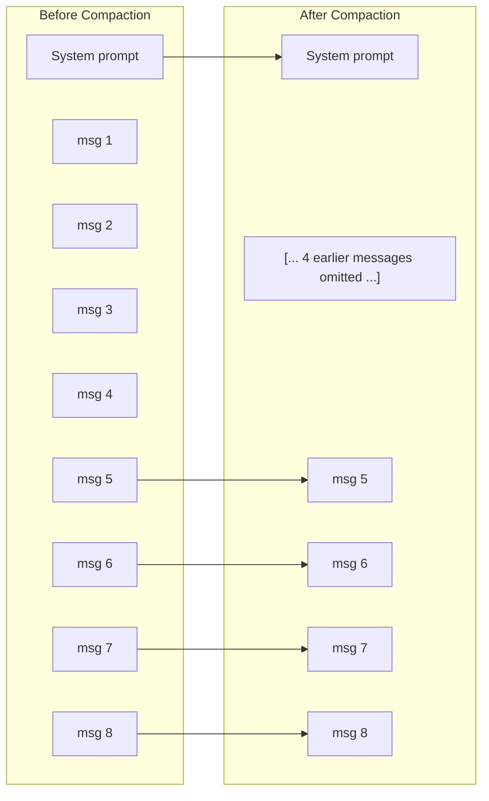

**Algorithm:**
1. Keep first message (system prompt) always
2. Keep last `recency_window` messages (default 20)
3. Drop oldest messages from the middle until under budget
4. Insert a marker message: `[... N earlier messages omitted ...]`
5. Emit `context_compacted` event with metrics

---

## 14. Error Recovery

**File:** `agent_host/loop/error_recovery.py`

Detects when the agent is stuck and injects prompts to help it recover.

```mermaid
stateDiagram-v2
    [*] --> Normal

    Normal --> ConsecutiveFailures: Tool failure
    ConsecutiveFailures --> ConsecutiveFailures: Another failure
    ConsecutiveFailures --> Normal: Tool success (reset)

    ConsecutiveFailures --> ReflectionInjected: failures >= 3
    Note right of ReflectionInjected: Injects reflection prompt:<br/>"Stop and think about<br/>what went wrong"

    Normal --> LoopDetected: Same tool+args >= 3 times
    Note right of LoopDetected: Injects loop-break prompt:<br/>"You MUST try a<br/>different approach"
```

### Two Mechanisms

**1. Consecutive Failure Reflection** (threshold: 3)

When 3+ tool calls fail in a row, a reflection prompt is injected:

```
## Self-Reflection Required

The last 3 tool calls failed. Stop and think about what went wrong.

1. WriteFile({"path": "/etc/config"}) → Permission denied
2. WriteFile({"path": "/etc/config"}) → Permission denied
3. WriteFile({"path": "/etc/config"}) → Permission denied

Consider:
- Is the approach correct, or should you try a different strategy?
- Are the arguments valid (correct paths, commands, etc.)?
- Is there a prerequisite step you missed?
```

A successful tool call resets the consecutive failure counter.

**2. Loop Detection** (threshold: 3)

When the same tool + arguments combination is called 3+ times (regardless of success), a loop-break prompt is injected:

```
## Loop Detected

You appear to be repeating the same tool calls without making progress.

- Called 4 times: WriteFile(a1b2c3d4)

You MUST try a different approach. Options:
- Use a different tool or different arguments
- Break the task into smaller subtasks
- Report what you've tried and ask the user for guidance
```

Tool call signatures use MD5 hashing of sorted arguments for deduplication.

---

## 15. Event System

**File:** `agent_host/events/event_emitter.py`

Events are emitted through two channels simultaneously:

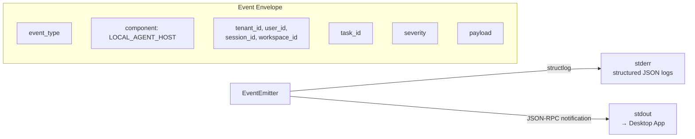

### Event Types

| Event | Severity | When |
|-------|----------|------|
| `session_created` | info | Session handshake complete |
| `session_completed` | info | Clean shutdown |
| `session_failed` | error | Unrecoverable session error |
| `task_completed` | info | Task finished successfully |
| `task_failed` | error | Task failed or hit step limit |
| `step_started` | info | Beginning of each loop iteration |
| `step_completed` | info | End of each loop iteration |
| `step_limit_approaching` | warning | At 80% of max_steps |
| `text_chunk` | info | Streaming LLM text delta |
| `tool_requested` | info | Before tool execution |
| `tool_completed` | info | After tool execution |
| `approval_requested` | info | Tool needs user approval |
| `llm_retry` | warning | Retrying transient LLM error |
| `context_compacted` | info | Messages dropped for context fit |

All emission is **fire-and-forget** — errors are logged but never propagated.

---

## 16. Token Budget

**File:** `agent_host/budget/token_budget.py`

Session-level cumulative token tracking against a budget from the policy bundle.

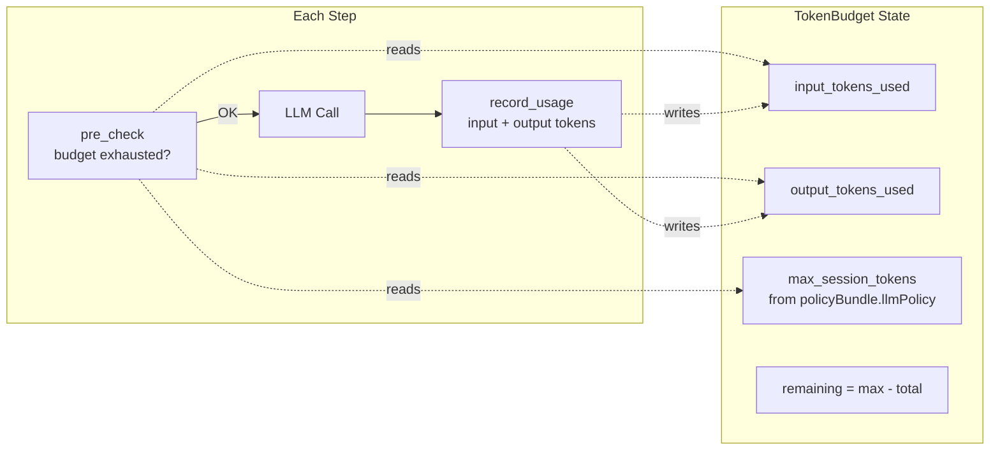

- `pre_check()` runs before each LLM call — raises `LLMBudgetExceededError` if exhausted
- `record_usage()` adds actual token counts from the LLM response
- `restore_usage()` restores from checkpoint (absolute overwrite, not additive)
- Thread-safe for single-threaded asyncio (no locks needed)
- Shared between parent agent and sub-agents

---

## 17. Crash Recovery (Checkpoints)

**Files:** `agent_host/session/checkpoint_manager.py`, `agent_host/loop/loop_runtime.py`, `agent_host/session/session_manager.py`

Atomic JSON file checkpoints enable crash recovery. Checkpoints are written **after each completed step** (not just at task end), and periodic workspace syncs provide machine-level durability.

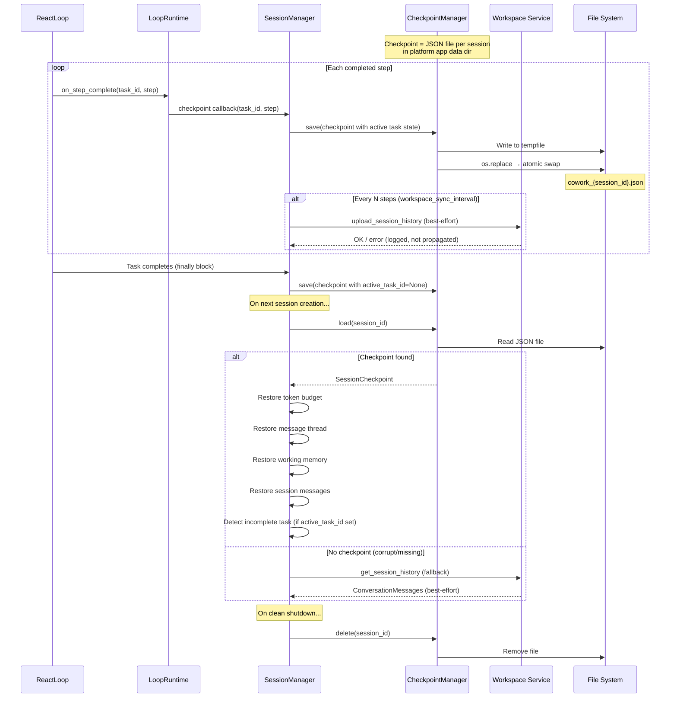

### Checkpoint Contents

```python
@dataclass
class SessionCheckpoint:
    session_id: str
    workspace_id: str
    tenant_id: str
    user_id: str
    token_input_used: int = 0
    token_output_used: int = 0
    session_messages: list[dict]        # Cumulative ConversationMessages
    thread: list[dict] | None = None    # MessageThread state
    working_memory: dict | None = None  # WorkingMemory state (tasks, plan, notes)
    checkpointed_at: str = ""           # ISO 8601 timestamp

    # In-progress task state (backward-compatible defaults)
    active_task_id: str | None = None          # Non-None = task in progress
    active_task_prompt: str | None = None       # The user prompt
    active_task_step: int = 0                   # Last completed step
    active_task_max_steps: int = 0              # Max steps for this task
    last_workspace_sync_step: int = 0           # Last step that synced to workspace
```

### on_step_complete Callback

`LoopRuntime` accepts an optional `on_step_complete: Callable[[str, int], Awaitable[None]]` callback, exposed via `LoopRuntime.on_step_complete()`. `ReactLoop` invokes it after `emit_step_completed` and before the 80% step warning check:

- **Awaited** (synchronous relative to the loop) — checkpoint must flush before the next step
- **Exception-safe** — failures are caught and logged; checkpoint failure never aborts the loop
- **Not called on loop exit** — the `_run_agent()` finally block handles end-of-task checkpoint

### Periodic Workspace Sync

Controlled by `WORKSPACE_SYNC_INTERVAL` (default: 5 steps, 0 = disabled). Every N steps, `_sync_history_to_workspace()` uploads `_session_messages` to the Workspace Service. This provides machine-level durability — if the disk is lost, conversation history survives in the backend.

### Restore Flow

On session creation or resume, `_restore_from_checkpoint()` restores state in this order:

1. **Token budget** — `restore_usage()` overwrites counters (absolute, not additive)
2. **Message thread** — `MessageThread.from_checkpoint()` rebuilds full conversation history
3. **Working memory** — `WorkingMemory.from_checkpoint()` restores tasks, plan, and notes
4. **Session messages** — Cumulative `ConversationMessage` list for history upload
5. **Incomplete task detection** — if `active_task_id` is set, stores task info for resume UI

Each restore step is independent — a failure in one does not block the others.

### Workspace Fallback

If the local checkpoint is corrupt or missing, `_restore_from_checkpoint()` falls back to the Workspace Service:

- Fetches conversation history via `get_session_history()`
- Restores `_session_messages` for continuity
- Cannot recover thread state, working memory, or token budget (those are local-only)
- Best-effort — failure is logged, session continues with empty state

### Mid-Task Resume

When `GetSessionState` includes an `incompleteTask` field (from checkpoint with `active_task_id` set), the Desktop App can offer "Resume interrupted task?" UI. On resume via `StartTask` with the same `taskId`:

- The user message is **not** re-added to the thread (already present from checkpoint)
- The agent loop continues from where it left off
- `_incomplete_task` is cleared after resume

### Corrupt Checkpoint Handling

If a checkpoint file is corrupt (invalid JSON, missing keys), it is **deleted** and the workspace fallback is attempted. This prevents a bad checkpoint from permanently blocking session creation.

**Write strategy:** `tempfile` → `os.replace()` (atomic on all platforms)
**File naming:** `cowork_{session_id}.json` in the platform checkpoint directory
**Lifecycle:** Saved after each completed step. Cleared (active_task_id=None) on task completion. Deleted on clean `Shutdown`.

### Checkpoint Events

| Event | When | Severity |
|-------|------|----------|
| `checkpoint_saved` | After each per-step checkpoint write | info |
| `checkpoint_restored` | After state restoration from checkpoint | info |
| `checkpoint_failed` | When checkpoint write fails | warning |
| `workspace_sync_completed` | After successful periodic workspace sync | info |
| `workspace_sync_failed` | When periodic workspace sync fails | warning |

---

## 18. Code Execution

**Files:** `tool_runtime/code/executor.py`, `tool_runtime/code/preamble.py`, `tool_runtime/tools/code/execute_code.py`

The code execution system enables the agent to run Python scripts as subprocesses with rich output support (images, structured data). It uses **stateless script execution** — each `ExecuteCode` call runs a complete, self-contained Python script. No state persists between calls.

### Architecture

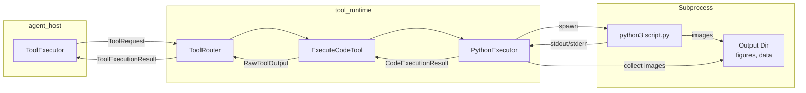

### Execution Flow

```mermaid
sequenceDiagram
    participant LLM as LLM
    participant AL as Agent Loop
    participant TE as ToolExecutor
    participant TR as ToolRouter
    participant ECT as ExecuteCodeTool
    participant PE as PythonExecutor
    participant Proc as Python Subprocess

    LLM->>AL: tool_call: ExecuteCode({code, description})
    AL->>TE: execute_tool_calls([call])
    TE->>TE: Policy check (Code.Execute capability)
    TE->>TE: Approval gate (if required)
    TE->>TR: execute(ToolRequest, ExecutionContext)
    TR->>ECT: execute(arguments, context)

    ECT->>PE: execute(code, working_directory, timeout)
    PE->>PE: Create temp dir /tmp/cowork-code-{uuid}/
    PE->>PE: Write preamble + code → script.py
    PE->>Proc: spawn python3 script.py<br/>env: MPLBACKEND=Agg, COWORK_OUTPUT_DIR
    Proc->>Proc: Execute script (preamble hooks plt.show)

    alt Success
        Proc-->>PE: stdout + stderr + exit_code=0
    else Error
        Proc-->>PE: stderr with traceback + exit_code=1
    else Timeout
        PE->>Proc: SIGTERM → 5s → SIGKILL (process group)
        PE-->>ECT: CodeExecutionResult(timed_out=True)
    end

    PE->>PE: Collect images from output dir
    PE->>PE: Cleanup temp dir
    PE-->>ECT: CodeExecutionResult

    ECT->>ECT: Format output text
    ECT->>ECT: Attach first image as ImageContent
    ECT-->>TR: RawToolOutput
    TR-->>TE: ToolExecutionResult
    TE-->>AL: ToolCallResult (with image_url if present)
```

### PythonExecutor

**File:** `tool_runtime/code/executor.py`

Manages the subprocess lifecycle for each code execution:

1. **Temp directory creation** — `/tmp/cowork-code-{uuid}/` for script + output files
2. **Script assembly** — Prepend preamble (matplotlib/pandas hooks) to user code, write to `script.py`
3. **Subprocess spawn** — `asyncio.create_subprocess_exec("python3", script_path)` with:
   - `cwd` = workspace directory (from `ExecutionContext`)
   - `env` = `MPLBACKEND=Agg` + `COWORK_OUTPUT_DIR={output_dir}`
   - `preexec_fn=os.setsid` (Unix) for process group management
   - `stdout=PIPE`, `stderr=PIPE`
4. **Timeout enforcement** — `asyncio.wait_for()` with configurable timeout (default 120s, max 600s)
5. **Process tree kill on timeout** — `os.killpg(pid, SIGTERM)` → wait 5s → `os.killpg(pid, SIGKILL)` (Unix); `taskkill /T /F` (Windows)
6. **Image collection** — Scan output dir for `*.png`, `*.jpg`, `*.jpeg`, `*.svg`, read as bytes
7. **Cleanup** — `shutil.rmtree(output_dir, ignore_errors=True)`

```python
@dataclass
class CodeExecutionResult:
    stdout: str
    stderr: str
    exit_code: int
    images: list[bytes]      # PNG/JPG image data from output dir
    execution_time: float    # seconds
    timed_out: bool
```

### Preamble Injection

**File:** `tool_runtime/code/preamble.py`

A Python code string prepended to every script before execution:

- **matplotlib hook** — Sets `matplotlib.use("Agg")` backend (non-interactive), overrides `plt.show()` to save each figure as `figure_{N}.png` in the output directory, then closes all figures
- **pandas display** — Sets `display.max_rows=50`, `display.max_columns=20`, `display.width=120` for readable text output
- **Namespace safety** — All preamble variables use underscore prefixes (`_plt`, `_fig_count`, `_output_dir`) to avoid polluting the user's namespace
- **Graceful fallback** — `try/except ImportError` around matplotlib and pandas imports; preamble is a no-op if libraries aren't installed

### ExecuteCodeTool

**File:** `tool_runtime/tools/code/execute_code.py`

| Input | Type | Required | Default | Description |
|-------|------|----------|---------|-------------|
| `code` | string | yes | — | Python code to execute |
| `description` | string | yes | — | What the code does (audit trail + approval dialog) |
| `timeout_seconds` | integer | no | 120 | Max execution time (1–600s) |

**Output format** (consistent with RunCommand):
```
# {description}
Exit code: {code}
--- stdout ---
{stdout}
--- stderr ---
{stderr}
[Execution time: X.XXs]
[TIMED OUT] (if applicable)
```

**Rich output:**
- First image from the output directory → `ImageContent` (returned as multimodal content to the LLM)
- Additional images → artifacts (uploaded to Workspace Service)
- Large text output (>10KB) → artifact extraction with truncation for LLM view

### Policy: `Code.Execute` Capability

| Scope Field | Type | Description |
|-------------|------|-------------|
| `allowedLanguages` | `string[]` | Languages permitted (e.g., `["python"]`) |
| `maxExecutionTimeSeconds` | `integer` | Max timeout per execution (1–600s) |
| `allowCodeNetwork` | `boolean` | Whether code can access the network (default: false) |

The `ExecuteCodeTool` respects the `maxExecutionTimeSeconds` from the policy bundle — if the tool's `timeout_seconds` argument exceeds the policy limit, the policy limit wins (takes the minimum).

---

## 19. Persistent Memory

The persistent memory system provides cross-session knowledge that survives between conversations. It implements a two-tier model inspired by Claude Code's memory architecture.

### Architecture

```mermaid
graph TD
    subgraph "Tier 1: Project Instructions (Human-Written)"
        CW[COWORK.md<br/>Team-shared, version-controlled]
        CWL[COWORK.local.md<br/>Personal, gitignored]
    end

    subgraph "Tier 2: Auto Memory (AI-Written)"
        MEM[MEMORY.md<br/>Concise index, 200 lines max]
        TF1[debugging.md]
        TF2[patterns.md]
        TFN[...topic files]
    end

    subgraph "Session Context"
        SP[System Prompt<br/>Includes project instructions]
        MI[Memory Injection<br/>MEMORY.md loaded every turn]
        MT[Memory Tools<br/>SaveMemory / RecallMemory / ListMemories]
    end

    CW --> SP
    CWL --> SP
    MEM --> MI
    TF1 -.->|on-demand via RecallMemory| MT
    TF2 -.->|on-demand via RecallMemory| MT
    TFN -.->|on-demand via RecallMemory| MT
```

### Tier 1: Project Instructions

**Files:** `COWORK.md` (team-shared) and `COWORK.local.md` (personal) at the project root and parent directories.

**Loading:** `ProjectInstructionsLoader` walks up the directory tree from `workspace_dir` to the filesystem root. At each level, it checks for `COWORK.md` and `COWORK.local.md`. Ancestors are loaded first (broadest scope), with workspace-level files last (most specific). Files are concatenated with `--- <path> ---` separators.

**Injection:** Loaded once at session start and appended to the static system prompt. Because the system prompt is always the first message, project instructions survive context compaction.

### Tier 2: Auto Memory

**Location:** `~/.cowork/projects/<hash>/memory/` where `<hash>` is the first 16 hex characters of the SHA-256 of the resolved workspace path.

**MEMORY.md:** The concise index file. First 200 lines are loaded automatically at the start of every session and injected as a system message after the system prompt. The agent is instructed to keep this file concise and move detailed notes to topic files.

**Topic files:** Additional `.md` files (e.g., `debugging.md`, `patterns.md`) created by the agent for detailed notes. These are NOT loaded automatically — the agent reads them on-demand using the `RecallMemory` tool.

**Tools:** Three agent-internal tools (bypass PolicyEnforcer):

| Tool | Purpose |
|------|---------|
| `SaveMemory` | Write/update memory files (atomic write) |
| `RecallMemory` | Read a specific topic file |
| `ListMemories` | List all `.md` files with sizes |

### Context Injection Order

```
messages[0]: System prompt (base + date + OS + workspace + project instructions + memory guidance)
messages[1]: Persistent memory (MEMORY.md first 200 lines)
messages[2]: Working memory (TaskTracker + Plan + Notes)
messages[3+]: Conversation history...
```

Both persistent memory and working memory are re-injected every LLM turn, so they survive context compaction.

### Key Components

| Component | File | Responsibility |
|-----------|------|---------------|
| **ProjectInstructionsLoader** | `memory/project_instructions.py` | Load COWORK.md from directory tree |
| **PersistentMemory** | `memory/persistent_memory.py` | Read/write auto-memory files |
| **MemoryManager** | `memory/memory_manager.py` | Orchestrate instructions + auto-memory |

### Sequence: Memory Loading at Session Start

```mermaid
sequenceDiagram
    participant SM as SessionManager
    participant MM as MemoryManager
    participant PIL as ProjectInstructionsLoader
    participant PM as PersistentMemory
    participant SPB as SystemPromptBuilder

    SM->>MM: MemoryManager(workspace_dir)
    SM->>MM: load_all()
    MM->>PIL: load(workspace_dir)
    PIL->>PIL: Walk directory tree
    PIL-->>MM: Concatenated COWORK.md content
    MM->>PM: load_index(max_lines=200)
    PM-->>MM: MEMORY.md content (≤200 lines)
    SM->>SPB: build_static_prompt(project_instructions=..., has_persistent_memory=True)
    SPB-->>SM: System prompt with instructions + memory guidance
```

---

## 20. Package Boundary & Dependency Rules

```mermaid
graph TD
    subgraph agent_host
        AH[Agent Host modules]
    end

    subgraph tool_runtime
        TRT[Tool Runtime modules]
    end

    subgraph cowork_platform
        CP[Contracts + SDK]
    end

    AH -->|imports| CP
    TRT -->|imports| CP
    AH -->|ToolRouter interface only| TRT
    TRT -.->|NEVER imports| AH

    style AH fill:#e8f5e9
    style TRT fill:#e3f2fd
    style CP fill:#fff3e0
```

**Strict rules:**
- `agent_host/` and `tool_runtime/` must **NOT** cross-import
- The only interface between them is: `ToolRouter`, `ExecutionContext`, `ToolExecutionResult`
- Both packages depend on `cowork-platform` for shared contracts (ToolRequest, ToolResult, ToolDefinition, PolicyBundle, etc.)

---

## Component Summary

| Component | File | Responsibility |
|-----------|------|---------------|
| **LoopRuntime** | `loop/loop_runtime.py` | Per-task infrastructure primitives facade |
| **LoopStrategy** | `loop/strategy.py` | Protocol: `async def run(task_id) -> LoopResult` |
| **ReactLoop** | `loop/react_loop.py` | Default strategy: linear ReAct loop + context assembly |
| **AgentLoop** | `loop/agent_loop.py` | Thin alias for `ReactLoop` (backward compat) |
| **SessionManager** | `session/session_manager.py` | Lifecycle coordinator, builds LoopRuntime + ReactLoop |
| **LLMClient** | `llm/client.py` | OpenAI SDK streaming + retry |
| **ToolRouter** | `tool_runtime/router/tool_router.py` | Tool registry + dispatch |
| **ToolExecutor** | `loop/tool_executor.py` | Policy + approval + artifacts |
| **PolicyEnforcer** | `policy/policy_enforcer.py` | Stateless capability validation |
| **ApprovalGate** | `approval/approval_gate.py` | asyncio Future-based approval |
| **TokenBudget** | `budget/token_budget.py` | Session token tracking |
| **MessageThread** | `thread/message_thread.py` | Conversation history |
| **DropOldestCompactor** | `thread/compactor.py` | Context window management |
| **WorkingMemory** | `memory/working_memory.py` | Task tracker + plan + notes |
| **AgentToolHandler** | `loop/agent_tools.py` | Internal tools + skill tools (no policy); uses callbacks for sub-agent/skill |
| **SubAgentManager constants** | `loop/sub_agent.py` | Constants only (spawning logic in LoopRuntime) |
| **SkillLoader** | `skills/skill_loader.py` | Load skills from 3 sources |
| **SkillExecutor constants** | `skills/skill_executor.py` | Constants only (execution logic in LoopRuntime) |
| **ErrorRecovery** | `loop/error_recovery.py` | Loop detection + reflection |
| **EventEmitter** | `events/event_emitter.py` | JSON-RPC notifications + logs |
| **CheckpointManager** | `session/checkpoint_manager.py` | Crash recovery persistence |
| **SystemPromptBuilder** | `loop/system_prompt.py` | Dynamic system prompt |
| **FileChangeTracker** | `agent/file_change_tracker.py` | Track file mutations for diffs |
| **MemoryManager** | `memory/memory_manager.py` | Orchestrate project instructions + auto-memory |
| **ProjectInstructionsLoader** | `memory/project_instructions.py` | Load COWORK.md from directory tree |
| **PersistentMemory** | `memory/persistent_memory.py` | AI-writable memory file storage |
| **PythonExecutor** | `tool_runtime/code/executor.py` | Stateless Python script execution |
| **ExecuteCodeTool** | `tool_runtime/tools/code/execute_code.py` | Python code execution tool (Code.Execute) |
