# Cowork Agent Loop — Conceptual Overview

A high-level guide to how the Cowork agent loop works: what happens when a user sends a prompt, how the agent thinks and acts, what guardrails keep it safe, and how it recovers from failures. No code — just concepts, flows, and diagrams.

---

## Table of Contents

1. [The Big Picture](#1-the-big-picture)
2. [Sessions and Tasks](#2-sessions-and-tasks)
3. [The ReAct Loop](#3-the-react-loop)
4. [Tools](#4-tools)
5. [Policy and Guardrails](#5-policy-and-guardrails)
6. [Human-in-the-Loop Approvals](#6-human-in-the-loop-approvals)
7. [Agent Memory](#7-agent-memory)
8. [Sub-Agents and Skills](#8-sub-agents-and-skills)
9. [Context Management](#9-context-management)
10. [Error Recovery](#10-error-recovery)
11. [Checkpointing and Crash Recovery](#11-checkpointing-and-crash-recovery)
12. [Token Budget](#12-token-budget)
13. [Desktop and Web — Same Loop, Different Transport](#13-desktop-and-web--same-loop-different-transport)

---

## 1. The Big Picture

The Cowork agent runs locally on the user's machine (or in a cloud sandbox). When the user sends a prompt, the agent enters a loop: it calls an LLM, the LLM decides what to do (use a tool, ask a question, or deliver a final answer), the agent executes the action, feeds the result back to the LLM, and repeats — until the task is done.

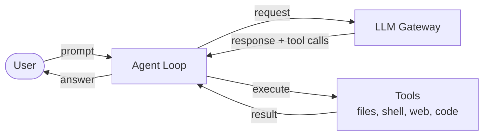

Everything the agent does is governed by a **policy bundle** that defines what capabilities are allowed, what paths are accessible, and what actions need human approval.

The agent loop has three layers of responsibility:

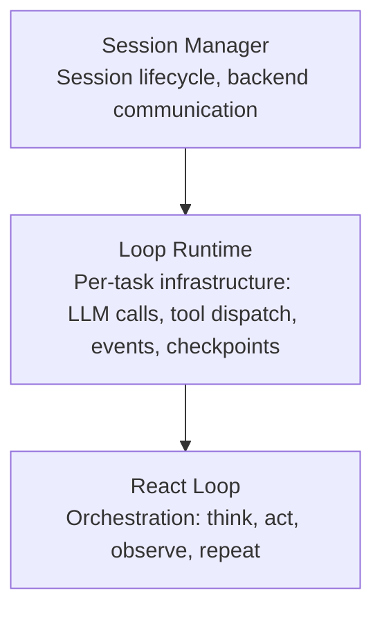

- **Session Manager** — manages the lifecycle of a conversation (creating sessions, starting tasks, shutting down)
- **Loop Runtime** — provides infrastructure primitives (call the LLM, execute a tool, emit an event, checkpoint)
- **React Loop** — the strategy that decides what to do each turn (build context, call LLM, route tool calls, check for completion)

---

## 2. Sessions and Tasks

A **session** is one conversation — it starts when the user opens a chat and ends when they close it. A session carries the policy bundle, token budget, and conversation history.

A **task** is one user prompt within a session. A multi-turn conversation has many tasks within the same session.

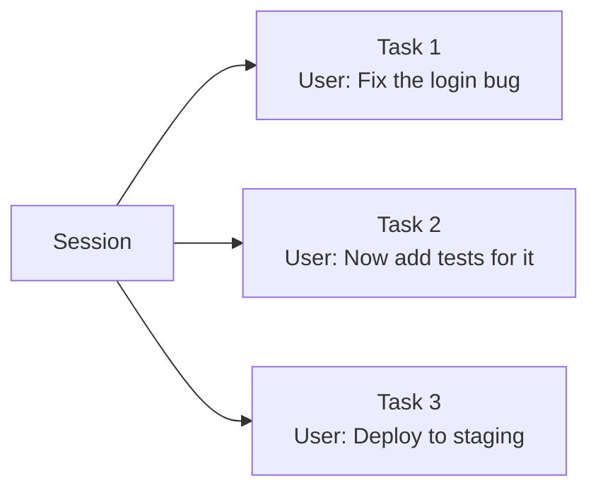

Each task runs a fresh agent loop cycle with a **step limit** (default 50 LLM calls). Tasks can be cancelled independently without ending the session.

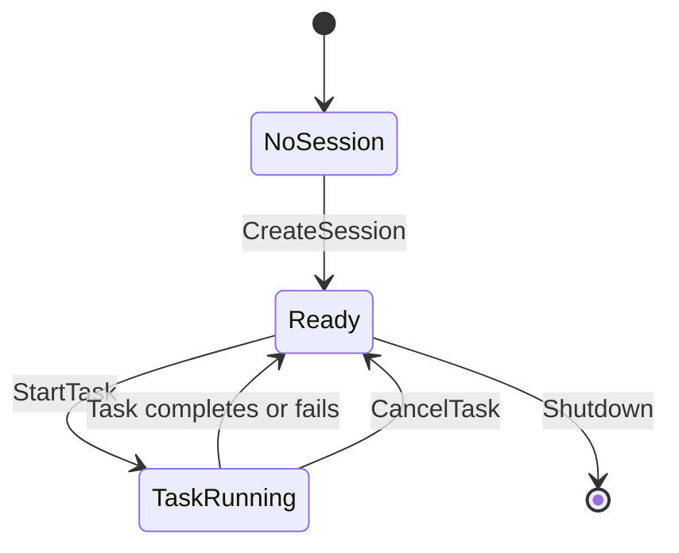

When a session starts, the agent handshakes with the **Session Service**, receives a policy bundle and workspace ID, and initializes all components (LLM client, policy enforcer, memory, skills, etc.).

---

## 3. The ReAct Loop

The core of the agent is a **ReAct loop** (Reason + Act). Each iteration is called a **step**: one LLM call followed by zero or more tool executions.

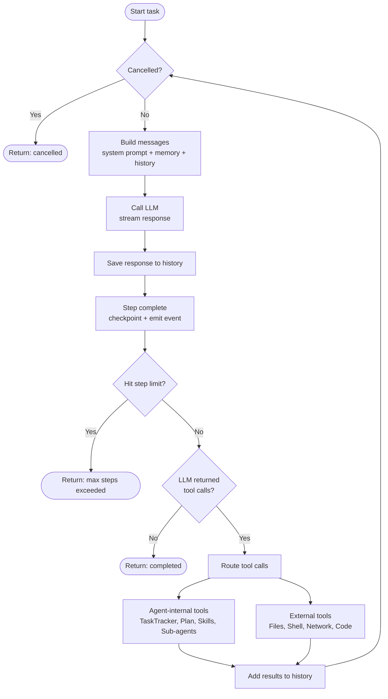

**Key behaviors:**

- The loop continues until the LLM stops calling tools and delivers a final answer
- At 80% of the step limit, a warning event is emitted so the UI can show a heads-up
- If the step limit is reached, the loop exits with "max steps exceeded"
- Cancellation is checked at the top of every iteration — cooperative, not forced

---

## 4. Tools

The agent has **16 built-in tools** organized into four categories:

### File Tools (11)

| Tool | What it does |
|------|-------------|
| **ReadFile** | Read file contents (with encoding detection) |
| **WriteFile** | Create or overwrite a file (generates a diff) |
| **EditFile** | Find-and-replace within a file |
| **MultiEdit** | Batch multiple find-and-replace edits in one call |
| **DeleteFile** | Delete a file |
| **CreateDirectory** | Create directories (including parents) |
| **MoveFile** | Move or rename files and directories |
| **ListDirectory** | List directory contents with metadata |
| **FindFiles** | Search for files by glob pattern |
| **GrepFiles** | Search file contents by regex |
| **ViewImage** | Read an image for the LLM to see (multimodal) |

### Shell Tool (1)

| Tool | What it does |
|------|-------------|
| **RunCommand** | Execute a shell command with timeout and process-tree kill on timeout |

### Network Tools (3)

| Tool | What it does |
|------|-------------|
| **HttpRequest** | Make HTTP requests (with SSRF prevention) |
| **FetchUrl** | Fetch a URL and convert HTML to readable markdown |
| **WebSearch** | Web search via Tavily API |

### Code Execution (1)

| Tool | What it does |
|------|-------------|
| **ExecuteCode** | Run a Python script in a sandboxed subprocess with image/chart output support |

### Agent-Internal Tools

In addition to the 16 external tools, the agent has **internal tools** that manage its own state. These bypass policy enforcement because they don't interact with the user's system:

| Tool | What it does |
|------|-------------|
| **TaskTracker** | Create, update, and list tracked sub-tasks |
| **CreatePlan** | Set a goal with ordered steps |
| **UpdatePlanStep** | Mark plan steps as in-progress, completed, or skipped |
| **SpawnAgent** | Delegate work to a sub-agent |
| **Skill_\*** | Execute a named skill (one tool per loaded skill) |
| **SaveMemory** | Write to persistent memory |
| **RecallMemory** | Read a memory file |
| **ListMemories** | List all memory files |

### How a Tool Call Flows

Every external tool call goes through a full lifecycle before execution:

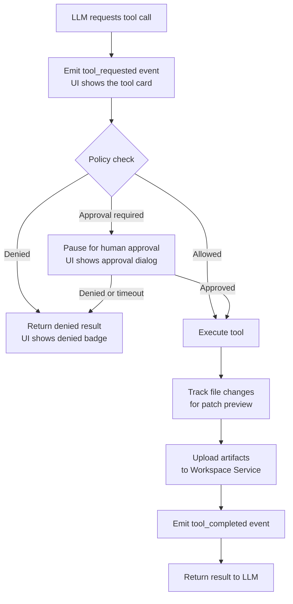

File-mutating tools (WriteFile, EditFile, etc.) are tracked by a **File Change Tracker** that captures before/after content. The Desktop App can show a unified diff of all changes made during a task via the **GetPatchPreview** command.

---

## 5. Policy and Guardrails

Every session starts with a **policy bundle** fetched from the Policy Service. The policy defines exactly what the agent can and cannot do.

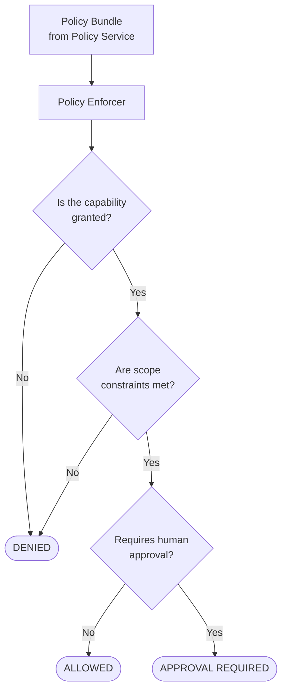

### Capabilities

Each tool maps to a **capability** (e.g., `File.Read`, `Shell.Exec`, `Network.Http`). The policy grants capabilities with optional scope constraints:

| Capability | Scope constraints |
|-----------|-------------------|
| **File.Read / Write / Delete** | `allowedPaths`, `blockedPaths` — which directories the agent can access |
| **Shell.Exec** | `allowedCommands`, `blockedCommands` — which commands are permitted |
| **Network.Http** | `allowedDomains`, `blockedDomains` — which domains can be reached |
| **Code.Execute** | `allowedLanguages` — which languages are permitted |
| **Search.Web** | No scope constraints |

The policy enforcer is **stateless and pure** — it takes the policy bundle at initialization and answers yes/no/approval-required for every tool call. No I/O, no side effects.

### Risk Assessment

When a tool requires approval, the system assesses its risk level (low, medium, high) based on the capability type. Destructive operations like file deletion are high risk; read operations are low risk.

---

## 6. Human-in-the-Loop Approvals

When a tool call requires approval, the agent **pauses and waits** for the user to decide:

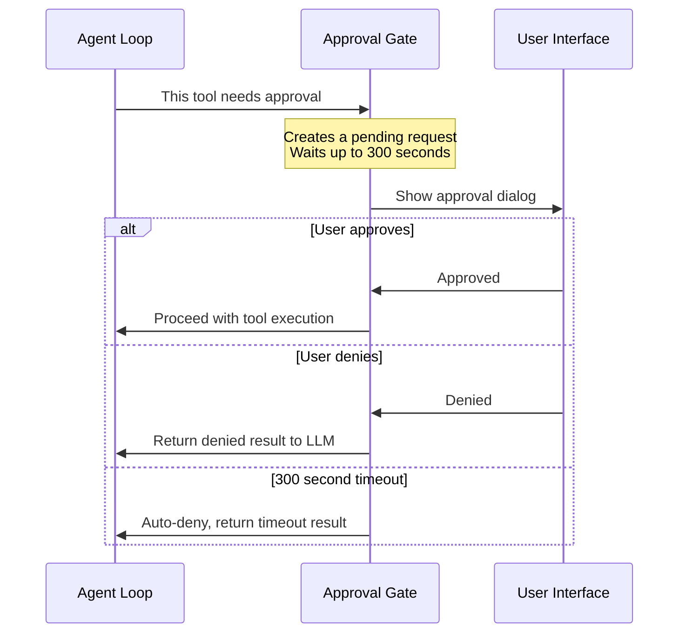

Key design choices:

- **No indefinite hangs** — there's always a 300-second timeout that auto-denies
- **Non-blocking for the user** — the approval request appears in the UI as a dialog; the user can review the tool name, arguments, and risk level before deciding
- **Denial is not failure** — when a tool is denied, the LLM receives a structured "denied" result and can try a different approach

---

## 7. Agent Memory

The agent has two layers of memory that help it stay on track and learn across sessions.

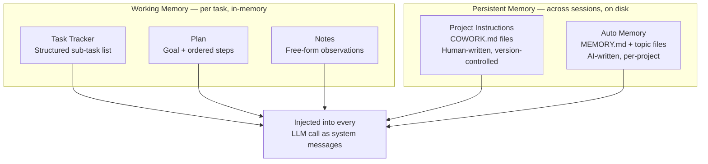

### Working Memory

Working memory is **structured state** that the agent maintains during a task. It is injected into every LLM call right after the system prompt, so the LLM always sees the current plan, tasks, and notes — even after context compaction drops older messages.

- **Task Tracker** — the agent creates, updates, and completes sub-tasks as it works through a complex request
- **Plan** — a goal with ordered steps; the agent marks steps as in-progress, completed, or skipped
- **Notes** — free-form text for observations and decisions

Working memory persists across tasks within the same session and is included in checkpoints for crash recovery.

### Persistent Memory

Persistent memory lives on disk and survives across sessions:

- **Project Instructions** (`COWORK.md`, `COWORK.local.md`) — human-written guidance files found by walking up the directory tree from the workspace. Loaded once at session start and baked into the system prompt.
- **Auto Memory** (`MEMORY.md` + topic files) — AI-written notes stored per-project. The agent can save observations, recall topic files, and list what's stored using internal tools. The `MEMORY.md` index (first 200 lines) is loaded automatically every session.

---

## 8. Sub-Agents and Skills

### Sub-Agents

When the LLM decides a piece of work should be delegated, it calls the **SpawnAgent** tool. This creates a **child agent** with its own conversation thread:

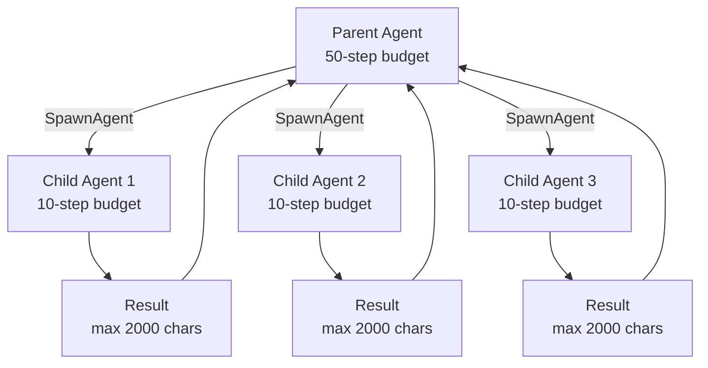

| Property | Parent | Sub-Agent |
|----------|--------|-----------|
| Conversation history | Cumulative (full session) | Fresh (isolated) |
| Token budget | Shared | Shared (same pool) |
| Step limit | 50 (configurable) | 10 (fixed) |
| Tools | All | All |
| Concurrency | — | Up to 5 concurrent sub-agents |

Sub-agents share the parent's token budget (so they can't overspend) but get their own conversation thread (so they don't pollute the parent's context). Results are truncated to 2000 characters before being returned.

### Skills

Skills are **reusable instruction sets** that teach the agent how to perform specific tasks. They're written as Markdown files with YAML frontmatter.

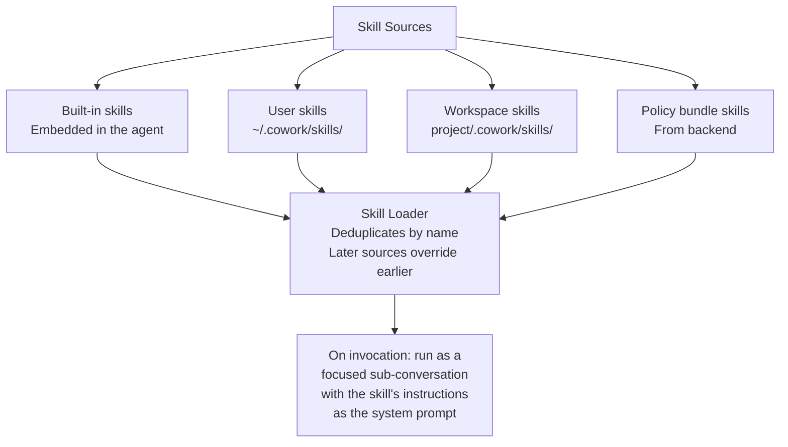

When the LLM calls a skill (e.g., `Skill_deploy_staging`), the agent:
1. Loads the skill's full content (Markdown body + supporting files)
2. Substitutes any `$ARGUMENTS` placeholders with the LLM's input
3. Runs a focused sub-conversation with its own thread and step limit

Skills appear to the LLM as regular tools — one `Skill_{name}` tool per loaded skill.

---

## 9. Context Management

As conversations grow, they can exceed the LLM's context window. The agent manages this with **context compaction**.

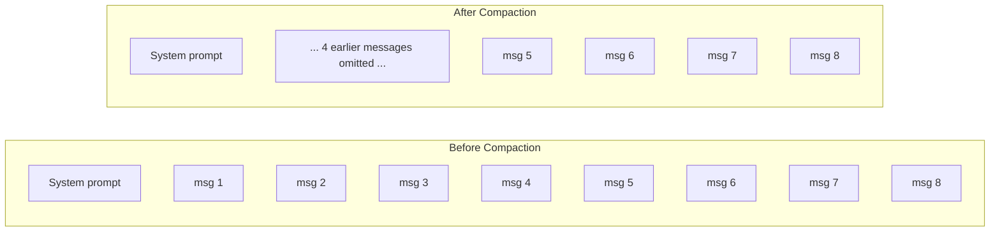

The agent uses **hybrid compaction** by default — a layered approach that tries to preserve as much context as possible before resorting to dropping messages.

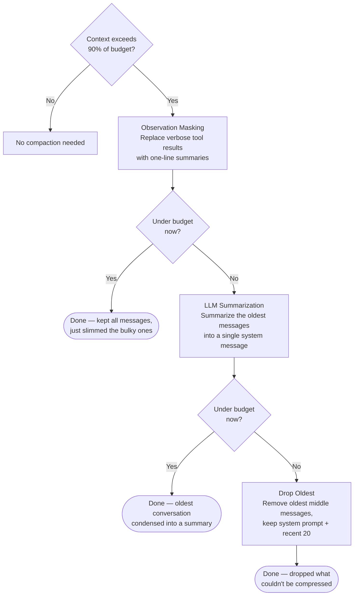

**Observation Masking** — The compactor first targets the bulkiest content: tool results. A tool result that returned 5KB of file content gets replaced with a one-line summary like `"[ReadFile: success, 247 lines / 5120 chars]"`. Failed or denied tool calls get similarly compact summaries like `"[WriteFile: denied]"` or `"[RunCommand: failed — Permission denied]"`. This typically achieves 50-70% compression since tool outputs are the largest messages, while keeping the full conversation flow intact — the LLM still sees that it called a tool and got a result, it just doesn't see the raw output anymore.

**LLM Summarization** — If masking alone isn't enough, the compactor calls the LLM to summarize the oldest portion of the conversation (everything between the system prompt and the recent 20 messages) into a single condensed system message. This preserves the key decisions and reasoning from earlier in the conversation, even though the individual messages are gone. The summary is pre-computed asynchronously before the compaction is needed, so it doesn't add latency to the main loop.

**Drop Oldest** — As a final fallback (rare in practice), any remaining messages that don't fit are dropped from the middle, with the system prompt and last 20 messages always preserved.

There's also a simpler **drop-oldest** strategy available (configurable via `COMPACTION_STRATEGY=drop_oldest`) that skips masking and summarization entirely — it just drops the oldest middle messages. This is used by sub-agents and skills, whose conversations are short-lived and don't benefit from the hybrid approach.

### What survives compaction (both strategies)

- **System prompt** — always kept (first message)
- **Persistent memory** — re-injected every turn
- **Working memory** — re-injected every turn (plan, tasks, notes)
- **Recent messages** — last 20 messages preserved

This means the agent's instructions, plan, and recent context always survive, even in very long conversations.

### Prompt Caching Optimization

Messages are ordered for LLM provider cache efficiency: stable content first (system prompt, persistent memory, conversation history), volatile content last (working memory, error recovery prompts). This maximizes cache hits across turns since the stable prefix rarely changes.

---

## 10. Error Recovery

The agent has two automatic recovery mechanisms when it gets stuck:

### Consecutive Failure Reflection

When **3 or more tool calls fail in a row**, the agent injects a reflection prompt asking the LLM to stop and reconsider:

> "The last 3 tool calls failed. Stop and think about what went wrong. Is the approach correct? Are the arguments valid? Is there a prerequisite step you missed?"

A successful tool call resets the counter.

### Loop Detection

When the **same tool with the same arguments** is called 3 or more times, a loop-break prompt is injected:

> "You appear to be repeating the same tool calls without making progress. You MUST try a different approach."

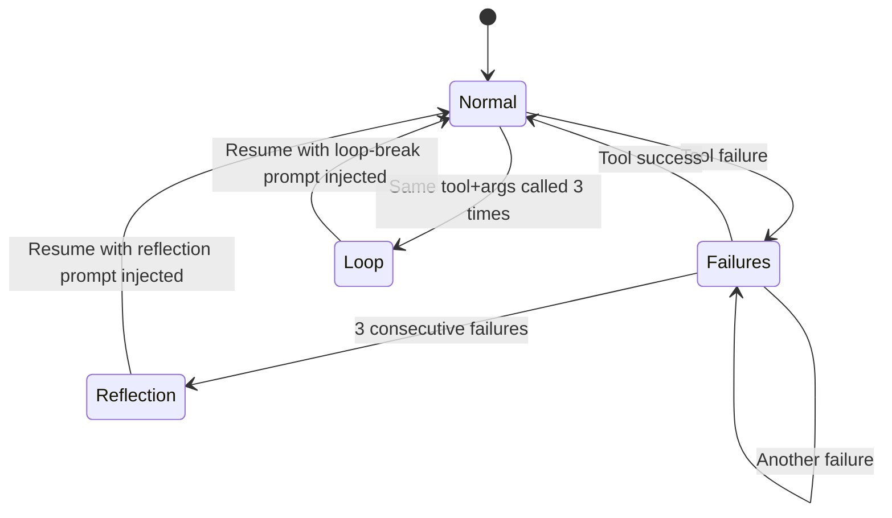

Both mechanisms inject prompts into the conversation rather than taking direct action — the LLM decides how to adjust.

---

## 11. Checkpointing and Crash Recovery

The agent writes a **checkpoint after every completed step** so it can recover from crashes without losing progress.

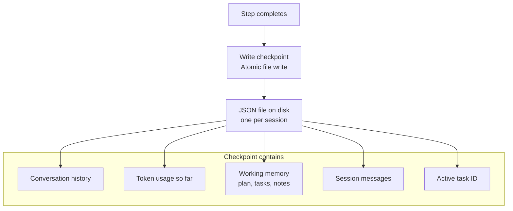

### How crash recovery works

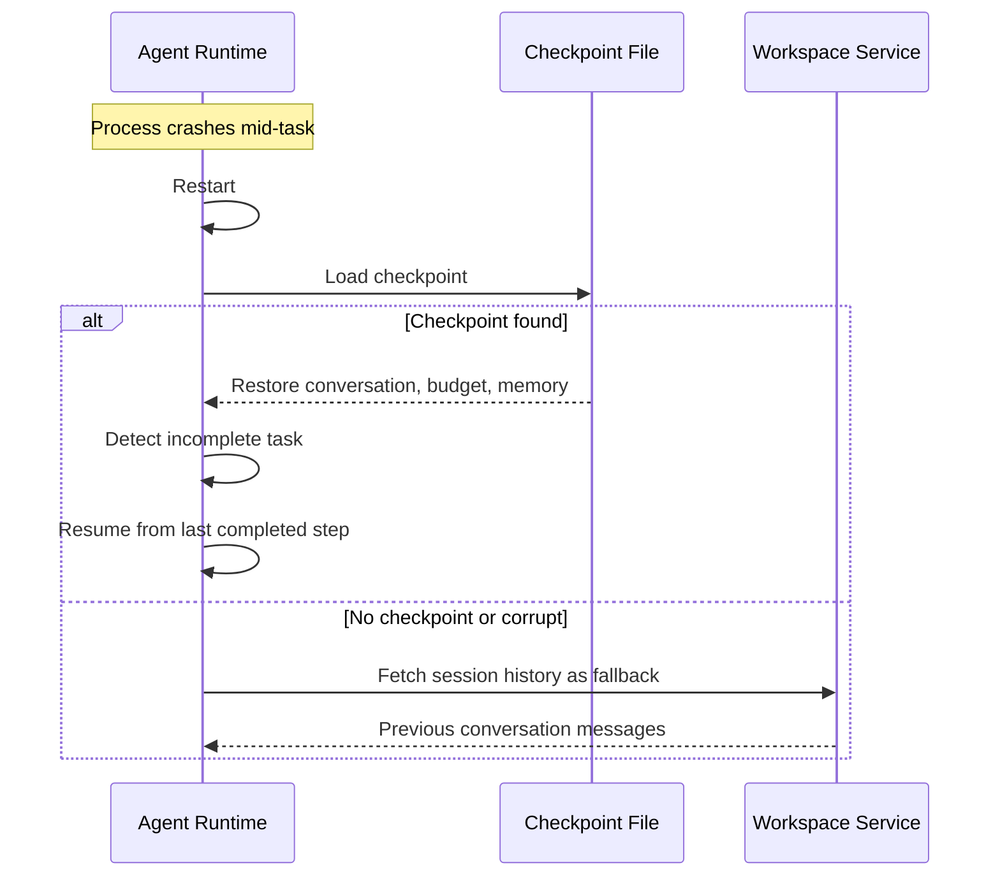

**Key details:**

- Checkpoints use **atomic file writes** (write to temp file, then rename) so a crash mid-write can't corrupt the file
- On clean shutdown, the checkpoint file is **deleted** — it's only for crash recovery
- Every N steps (configurable), the checkpoint is also **uploaded to the Workspace Service** for machine-level durability (e.g., if the disk fails)
- The checkpoint stores the active task ID, so on recovery the agent can detect and report an incomplete task

---

## 12. Token Budget

Each session has a **token budget** from the policy bundle that limits total LLM token usage across all tasks.

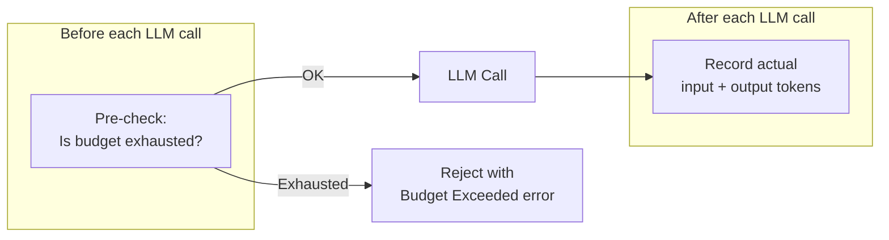

- The budget is **cumulative** — it tracks total tokens used across all tasks in the session
- Sub-agents **share** the parent's budget (so a sub-agent can't bypass limits)
- The budget is included in checkpoints for crash recovery
- If the budget is exhausted, the LLM call is rejected before it's made — no wasted API calls

---

## 13. Desktop and Web — Same Loop, Different Transport

The same agent loop runs in two environments:

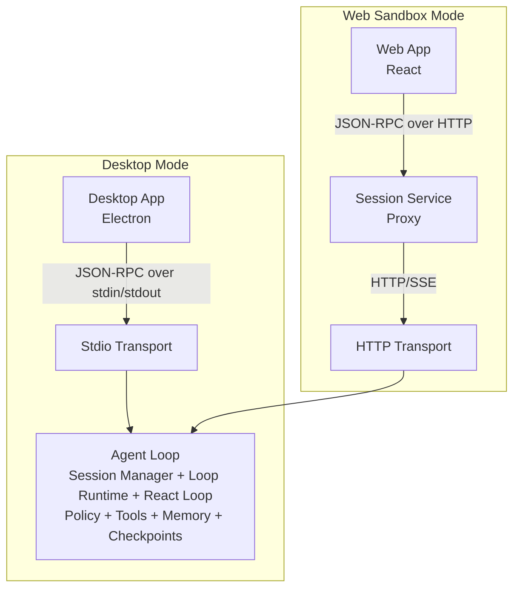

### Desktop Mode (stdio)

- The Desktop App spawns the agent runtime as a **child process**
- Communication happens over **stdin/stdout** using JSON-RPC 2.0
- The user sends `CreateSession` to start, `StartTask` for each prompt
- Events (progress, tool calls, approvals) stream back as JSON-RPC notifications

### Web Sandbox Mode (HTTP)

- The agent runtime runs inside an **ECS Fargate container**
- Communication happens over **HTTP** (JSON-RPC via `POST /rpc`) and **SSE** (events via `GET /events`)
- The container **self-registers** with the Session Service on startup
- Workspace files are **downloaded from S3** before serving, and **uploaded back** on shutdown
- The Session Service acts as a proxy — the browser talks to the Session Service, which forwards to the container

### What's shared

Everything except the transport layer is identical:

- Same agent loop (React Loop)
- Same tools and policy enforcement
- Same memory system
- Same checkpointing
- Same event model (events just go over different transports)
- Same JSON-RPC methods

An **event buffer** with monotonic IDs enables replay for both modes — the Desktop App can replay events after navigating away, and the web client can reconnect to SSE with `?since={lastEventId}` without missing events.

### Verification

After the agent signals task completion, a **self-verification step** runs: the agent is prompted to review its own work and can make corrections before the task is truly marked complete. This adds a small number of extra steps to the budget but catches mistakes before the user sees the result.
